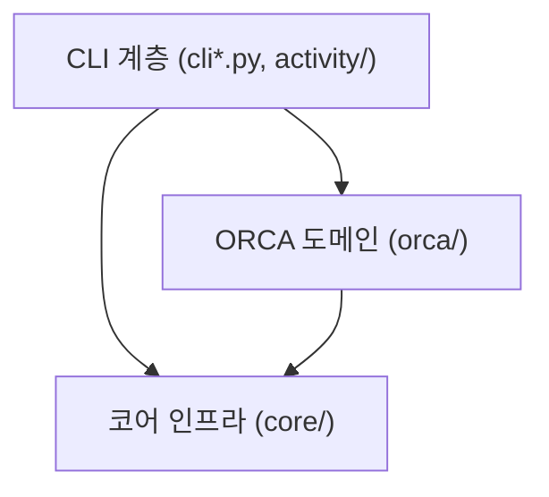

# 아키텍처 및 설계 원칙

[English](ARCHITECTURE.md) | **한국어**

ORCA_auto는 Linux 및 WSL 환경에서 단독 ORCA 양자화학 계산을 실행하고 감독하는 큐 기반 런타임입니다.

---

## 1. 핵심 설계 철학

> 한 동작을 따라갔을 때 원본, 변경 책임, 결과를 일관되게 설명할 수 있다.

ORCA_auto를 변경할 때 아래 책임 표를 기준으로 동작을 따라갑니다. 실패·취소·재개에서도 작업 ID와 실행/generation 식별자가 연결되어야 합니다.

| 동작 | 원본 | 변경 책임 | 결과 |
| :--- | :--- | :--- | :--- |
| 제출 | 선택한 `.inp`, 참조 파일, 자원 지시어 | `submission.py`와 입력 스냅샷 바인딩 | generation에 연결된 입력과 디스크 큐 항목 |
| 실행권 할당 | 큐 항목과 실행권 기록 | 부모 큐 워커가 admission 저장소를 통해 변경 | 예약된 슬롯과 해당 작업에 연결된 자식 프로세스 |
| 계산 | generation에 고정된 입력과 ORCA 실행 파일 | 자식 워커의 attempt 엔진 | 출력 파일과 기록된 실행 근거 |
| 결과 발행 | 실행 근거와 종료 판정 | 정상 종료는 attempt 보고 계층, 중단·복구는 부모의 terminal replay | 종료 상태와 `machine.json`을 포함한 generation 보고서 |
| 완료 알림 | 작업·실행 ID가 일치하는 루트의 종료 `job_state.json`과 최종 결과 | 부모 큐 워커가 실행 잠금 안에서 상태 저장 계층을 통해 한 번 전송권을 기록하고, 전송기는 확보한 메시지만 전달 | 루트의 알림 처리 기록; generation 실행 상태와 보고서는 변경하지 않음 |
| 조회 | 큐·상태 파일과 작업 위치 기록 | 인덱스 발행자가 조회용 파생 데이터를 갱신 | CLI 목록과 activity 화면 |

변경을 검토할 때는 해당 동작의 원래 근거, 상태를 바꾸는 주체, 사용자가 확인할 결과를 짚습니다. 완료 알림은 한 주체가 맡고, 발행 복구를 기다리는 큐 항목만 실행권 할당에서 보류합니다. 접수 당시의 입력 출처는 실행 기록을 거쳐 결과 파일까지 이어집니다. 종료 근거 확정, 실행권 반환, 재시도 가능한 발행은 아래 책임 순서를 따릅니다.

1. **디스크 큐 기반 영속 실행**: 작업 제출 시점에 디스크에 원자적으로 기록되어 터미널 세션이 끊기거나 시스템이 재부팅되어도 작업이 유실되지 않습니다.
2. **독립된 실행 디렉터리 격리 (`generation`)**: 동일한 작업 디렉터리에 재제출하더라도 이전 실행 기록을 덮어쓰지 않고 새로운 타임스탬프 기반 디렉터리(`generation`)에 분리하여 저장합니다.
3. **명시적 장애 기록 및 복구**: 계산 실패 시 원본 입력을 임의 수정하거나 자동으로 재시도하지 않으며, 구체적인 실패 원인을 진단하여 기록합니다.
4. **디스크 파일 중심 상태 관리**: 모든 상태와 결과의 기준 데이터는 디스크에 저장된 JSON 파일(`job_state.json`, `queue.json`)입니다. 빠른 조회를 위한 SQLite 인덱스는 원본 데이터로부터 언제든 결정론적으로 다시 생성할 수 있습니다.

---

## 2. 계층 구조 및 책임 경계

의존 방향은 엄격하게 **`CLI / UI` → `orca` (도메인) → `core` (인프라)**의 단방향 흐름을 따릅니다. 도메인 및 코어 계층은 상위 CLI 계층을 참조하지 않습니다.

| 패키지/모듈 | 주요 역할 및 책임 |
| :--- | :--- |
| **`cli*.py`, `activity/`, `terminal.py`** | 사용자 명령어 파싱, 텍스트/JSON 포맷팅 및 ANSI 스타일링, activity 레코드 모델, 큐 및 서비스 상태 조회, 작업 취소 인터페이스 |
| **`orca/`** | ORCA 전용 로직: 입력 파일(`.inp`) 파싱 및 자원 판별, 실행 준비, 큐 워커 및 프로세스 구동, 출력 로그 분석 및 수렴 판정, 결과 보고서(`machine.json`) 생성 |
| **`core/`** | 공용 인프라: 디스크 큐 저장소, 동시 실행 슬롯(Admission) 관리, 프로세스 감독 및 PID 파일 관리, 파일 I/O 및 설정 로더, SQLite 인덱스, 파일시스템 잠금 |

> **아키텍처 특징**: 엔진은 ORCA 하나입니다. 워크플로우, conformer scaffold, xTB/CREST 엔진(`flow/`)은 7.0에서 제거되었습니다.

---

## 3. 작업 제출 및 실행 수명 주기 (Lifecycle)

### 1. 제출
- `orca_auto run-dir <PATH>` 실행 시 `orca/submission.py`가 디렉터리 내 최신 `.inp` 파일과 자원 설정(`%pal`, `%maxcore`)을 파싱합니다.
- 입력 파일 및 종속 파일의 스냅샷을 구성하고, 큐에 작업을 등록한 후 CLI는 즉시 반환됩니다.

제출 스냅샷의 `source_inputs`에는 원본 경로, SHA-256 해시, 바이트 수가 기록됩니다. 제출 계층이 자원 지시어 보완과 generation 내부 참조 경로 변경을 맡습니다. `resource_request`는 확정된 자원 요청을, `bound_selected_identity`는 ORCA에 전달할 실제 `.inp`를 식별합니다. 참조 파일은 `source_inputs`와 `materialized_inputs`에서 같은 역할 키로 연결됩니다. 모두 접수 시점의 정보이며, `runtime_mutable_input_roles`는 엔진이 덮어쓸 수 있는 복사본을 구분하고 장애 복구 시 `recovery`는 이전 generation과 복구에 사용한 파일의 식별 정보를 보존합니다. 실행은 이 근거를 독립된 복사본으로 `job_state.json`의 `engine_payload.execution_provenance`에 전달하며, 나중의 원본 파일을 다시 읽어 당시 출처를 추정하지 않습니다.

정상 제출과 발행 복구는 디스크 큐 항목을 같은 `queue/job_records.py`에 전달합니다. 선택 입력과 자원은 접수 당시 메타데이터에서 읽고, 과거 항목의 요청 정보가 비었으면 스냅샷의 자원과 설정 기본값 순서로 보완합니다. 실제 자원 정보가 비었으면 확정된 요청을 사용합니다. 접수 당시 작업 종류·분자 식별자가 없으면 `other`/`unknown`으로 표시합니다. 위치 기록을 다시 만들기 위해 변경 가능한 입력 파일을 다시 읽지 않습니다.

### 2. 디큐 및 자원 할당
- 백그라운드 상주 워커 데몬이 큐를 주기적으로 확인합니다.
- 발행 복구는 디스크 큐 항목을 원본으로 대기 작업의 위치 기록을 만듭니다. 다른 발행자가 잠금을 잡고 있거나 인덱스 저장이 실패하면 해당 항목을 보류하고, 준비된 다른 작업에 가용 슬롯을 할당합니다. 발행 상태가 `complete`여도 경로 검증이나 안전 차단 기록이 실패한 항목은 이번 할당에서 제외합니다. 다음 할당 시 다시 검사·복구하며, 큐 원본을 읽을 수 없으면 실행을 보류합니다.
- 실행 가능한 작업이 발견되면 공유 슬롯(`scheduler.max_active_simulations`) 및 호스트 메모리 여유분(RAM Scratch 사용 시)을 검토합니다.
- 자원이 충분하면 슬롯을 예약하고 격리된 실행 디렉터리(`generation`)를 생성하여 ORCA를 구동합니다. 가용 메모리가 일시적으로 부족하면 작업을 실패 처리하지 않고 대기(`pending`) 상태로 되돌리며, `queue list`에는 자원 대기로 표시됩니다.

### 3. 실행 감독 및 복구
- 워커는 자식 프로세스의 상태를 추적하며, 외부 시그널(SIGTERM) 수신 시 프로세스를 정리하고 정상 종료합니다.
- 작업이 비정상 종료되어도 큐와 실행 상태 파일에 명확한 원인이 영속적으로 기록됩니다.

### 4. 상태 확정 및 결과 저장
- ORCA 계산이 끝나면 `orca/out_analyzer.py`가 출력 파일의 정상 종료 배너 및 오류/미수렴 마커를 분석합니다. (입력 echo나 주석에 포함된 오류 문구는 제외)
- 검증된 계산 데이터(에너지, 수렴 여부, 열역학 데이터 등)를 바탕으로 다운스트림 도구 연동을 위한 표준 `machine.json`(v1 Envelope 규격) 및 HTML 요약본을 생성합니다.

원본 근거가 기록된 결과는 `machine.json`보다 먼저 `execution_provenance.json`을 발행합니다. 보고서 발행자는 generation에 기록된 근거를 복사하고, 기계 결과는 `input`, `orca-output`과 함께 `execution-provenance` artifact로 이를 참조합니다. 읽는 쪽은 파일 영수증과 generation 상태의 근거가 일치하는지 검증합니다. 종료 보고서와 그 출처 파일은 불변이며, 종료 처리를 재실행해도 출처 artifact가 없는 과거 보고서를 포함해 당시의 근거를 유지합니다.

### 결과 발행과 큐 종료 처리

자식은 실행 상태와 generation 보고서를 발행합니다. 자식이 종료되면 부모는 엔진 종료·복구를 확인하고, 큐 generation에 복구 표식을 저장한 뒤 누락된 실패·취소 근거를 확정합니다. 이 근거로 큐의 실제 결과와 실행 식별자를 맞춥니다. 종료 코드가 0이어도 해당 작업의 종료 상태가 있어야 하며, 종료 코드만으로 결과를 대신하지 않습니다.

부모는 준비된 항목을 복구 담당 목록에 넘긴 뒤 실행 슬롯을 반환합니다. 그다음 위치 인덱스 발행, 한 번의 알림 전송권 확보, 복구 표식 제거 확인을 수행합니다. 정상 종료와 재시작 복구는 같은 마무리 함수를 사용합니다. 인덱스 저장이나 표식 제거가 실패하면 복구 항목을 남겨 같은 폴더의 다음 제출을 보류하고, 준비된 다른 작업은 반환된 슬롯을 사용할 수 있습니다. 디스크의 큐 표식으로 새 워커도 이어받으며 계산을 다시 실행하지 않습니다. 엔진 복구·상태 확정·슬롯 반환이 실패하면 감독 중인 작업을 유지해 재시도합니다. 발행 복구는 주기적으로 재시도하고, 알림 전달은 best-effort 방식입니다.

종료 복구 표시는 activity 조회에도 반영됩니다. 실행의 종료 상태는 유지하고 상세에 `result publication pending`을 표시합니다. `publication_blocked_scope=orca_terminal_publication`, 사유·다음 조치, `publication_owner=orca_queue_worker`가 남은 발행 책임을 설명합니다. 행이 필터로 숨겨져도 해당 폴더의 차단 근거는 `admission_blockers`에 남습니다. 잘못된 표시는 자동 복구를 약속하지 않고 점검을 안내하며, 유효한 복구 표시가 제거되면 발행 대기 표시도 사라집니다.

### 상태 파일의 책임

| 파일 | 원본과 용도 | 변경 책임 |
| :--- | :--- | :--- |
| 작업 루트의 `job_state.json` | 현재 작업·실행의 식별자와 실행 상태, 부모가 사용하는 알림 처리 기록 | 자식 실행기 또는 부모의 복구·알림 처리가 호출하는 `orca/state.py` |
| generation의 `job_state.json` | 해당 실행의 근거와 결과 검증에 쓰는 기록 | 같은 상태 저장 계층이 generation 소유권을 검증한 뒤 실행 사실이 바뀔 때만 갱신 |

상태 저장 계층은 루트의 변경 잠금 안에서 바뀐 generation 근거를 먼저 저장하고 현재 루트를 갱신합니다. 알림 전송권·전송 완료 표식은 루트의 운영 기록이며, 새로 쓰는 generation 상태에서는 제외합니다. 실행 사실이 같으면 generation의 바이트와 `updated_at`을 유지하고 루트의 갱신 시각만 바뀔 수 있습니다. 따라서 같은 종료 처리를 반복해도 실행 이력을 다시 쓰지 않습니다. 과거 generation에 들어 있는 알림 표식은 계속 읽을 수 있고, 실행 사실이 같으면 그대로 둡니다.

두 파일은 순서대로 교체하며 하나의 원자적 트랜잭션은 아닙니다. generation 저장이 실패하면 루트는 그대로 두고, 루트 저장이 실패하면 먼저 저장된 generation 근거를 보존한 채 오류를 알립니다. 같은 실행 상태를 다시 저장하면 generation을 다시 쓰지 않고 루트를 갱신합니다. 소유권이 확인된 generation의 기존 상태를 읽을 수 없으면 두 상태 파일의 교체를 거부합니다. `queue list clear`는 정리 가능한 루트 상태를 제거하고 generation 산출물은 보존합니다.

### 워커의 책임과 자식 실행
워커는 감독과 실행을 분리합니다.

`OrcaQueueWorker`(`orca/queue/worker.py`)가 유일한 큐 워커다. PID 파일과 단일
실행 잠금의 생명주기, 실행 슬롯 예약(행을 ID로 인수하기 전에 슬롯을 먼저 예약하며,
미리 읽은 행을 `expected_entry`로 사용), 자식 시작과 슬롯 연결, 종료 확정, 취소,
셧다운, 고아 행 정리를 모두 소유한다. 기반 클래스 `core.queue.worker.QueueWorkerLoop`는
패스 순서(회수, 취소, 수용, 대기), 셧다운 sweep, 시그널 핸들러만 담당하며 작업을
프로세스가 딸린 레코드로만 안다. 테스트는 `_start_background_process`와 `sleep_fn`을
교체하며, 주입되는 의존성 묶음은 없다. 부모 진입점은
`python -m orca_auto.orca.commands.queue --config …`, 자식 진입점은
`python -m orca_auto.orca.commands.worker_child --config … --queue-root …
--queue-id … [--admission-token …]`이다.

취소 관찰은 변경되지 않은 큐 스냅샷을 재사용한다. 자식은 종료 상태와 보고서를 발행한 뒤 종료합니다. 부모가 큐의 종료 처리를 정리하고 작업·실행 ID가 일치하는 상태에서 완료 알림의 전송권을 기록합니다. 동시 전송 수가 제한된 백그라운드 전송기는 확보한 메시지만 전달하며, 실행 슬롯을 붙잡거나 전송 후 상태를 다시 쓰지 않습니다. 종료 처리를 반복해도 이미 전송권을 기록한 알림은 건너뛰며, 과거 전송 완료 표식도 인식합니다. 알림은 참고용이므로 전송권 기록 뒤 프로세스가 중단되거나 전송 실패·용량 부족이 발생하면 유실될 수 있고, 이를 재시도하거나 계산 결과를 변경하지 않습니다. 제출은 디스크 큐 항목에 `orca_queued_notification_pending`을 기록합니다. 위치 기록 발행 후 부모 워커가 큐 잠금 안에서 전송권을 확보하고 제출 알림을 별도로 전달하므로 CLI가 종료돼도 전송 전의 의도는 남습니다. 이 표시가 없는 과거 항목의 알림을 소급 전송하지 않습니다. 자식은 시도 시작을 기록한 뒤 시작 알림을 캡처해 별도로 전달하고 계산을 진행합니다. 세 알림은 같은 전송기를 사용하며 동시 전송 수는 프로세스당 4개입니다. 전송 실패·용량 부족·프로세스 종료로 참고용 메시지가 유실될 수 있고, 전송기는 실행 상태를 쓰지 않습니다. 제출 알림의 전송권 기록이 실패하면 전송을 건너뛰되 실행권 할당은 보류하지 않습니다.

워커 CLI는 설정 로드, PID 확인(`orca/queue/orphans.py`의 `read_worker_pid`),
ORCA 워커 생성·실행을 직접 수행한다. `orca/queue/roots.py`가 루트 선택, 행 나열,
ID 기준 fenced 인수를 소유하며 큐 선두 위치로 행을 인수하는 일은 없다.
`queue/replay.py`는 재처리 엔진(작업 항목, 종료 준비와 발행, 정리 파이프라인,
generation 소유자 결정)만 담당하며 상태를 인자로 명시적으로 받고,
`queue/run_state_replay.py`는 `run.lock` 아래에서 종료 `job_state.json`을
합성한다. 각 경로는 선택한 큐 행과 작업 식별자를 구체적인 어댑터에 전달한다.
종료 근거를 확정한 뒤 실행 슬롯을 해제하고, 파생 결과 발행은 복구 표식으로 같은 폴더를 보호하며 재시도한다. RUNNING 행 정리는 워커가 소유한다:
제출은 큐 전체를 훑지 않으며, 살아 있는 워커 pid가 없을 때 자기 디렉터리의
죽은 행만 복구한다.

ORCA 자식은 큐 항목 조회, 중단된 generation 복구, 부모의 실행권 인계 대기,
해당 generation 실행을 직접 수행한다. 성공·중단·예외 모두 최종 슬롯 해제는
부모가 소유한다. 검증한 입력·자원·큐 식별자는 `RunExecutionContext` 한 개로
구성해 실행 단계로 전달하며, CLI 인자를 다시 만들거나 빈 생명주기 콜백을
등록하지 않는다.

---

## 4. 운영 아키텍처

- **SQLite 조회 캐시**: 대량의 계산 이력이 쌓여도 빠른 조회가 가능하도록 SQLite 기반 activity 인덱스를 운영합니다. 이 캐시는 위치 항목을 작업 ID 기준으로 관리하며, `job_locations.json` 자체는 디스크의 실행 상태에서 `index rebuild`로 재구성할 수 있고 `--refresh`는 같은 재구성으로 미등록 실행을 기록합니다. 목록이 적용하는 실행 상태·스냅샷 대체 규칙은 CLI 계층이 아니라 `orca/run_status.py`에 있습니다. `index rebuild`는 디스크에서 유도한 위치 기록을 병합하며 SQLite activity DB 재생성 명령은 아니다.
- **Scratch 운영 명령**: `orca_auto scratch list`와 `scratch clear`로 비활성(non-live) RAM scratch 워크스페이스를 점검·제거합니다. stale, unverifiable, invalid-manifest 워크스페이스가 하나라도 남아 있으면 이후의 모든 scratch 실행이 차단(fail-closed)됩니다.
- **불변 휠 런타임 (Prepared Wheel Runtime)**: 프로덕션 서버 환경에서는 Git 체크아웃 대신 검증된 불변 wheel 런타임을 배포하여, 체크아웃 변경이나 의존성 혼선 없이 운영 환경을 격리합니다 ([docs/RUNTIME.md](RUNTIME.md)).
- **과거 데이터 보호**: 7.0에서 지원 종료된 이전 워크플로우 디렉터리는 과거 계산 데이터를 보존하기 위해 읽기 전용으로 보호되며, 해당 디렉터리에서 새로운 실행이 시작되는 것을 방지합니다.
