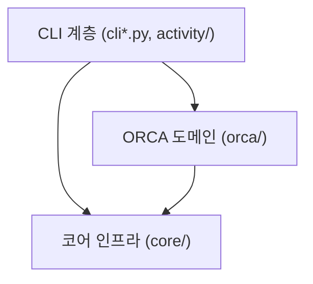

# 아키텍처 및 설계 원칙

[English](ARCHITECTURE.md) | **한국어**

ORCA_auto는 Linux 및 WSL 환경에서 단독 ORCA 양자화학 계산을 안정적으로 실행하고 모니터링하기 위한 큐 기반 런타임입니다.

---

## 1. 핵심 설계 철학

1. **디스크 큐 기반 안정적 실행 (Durable Queueing)**:
   사용자가 작업을 제출하면 즉시 디스크에 원자적으로 저장되며, 터미널 종료나 시스템 재부팅 후에도 작업이 유실되지 않습니다.
2. **독립된 실행 디렉터리 격리 (Generation Isolation)**:
   동일한 작업 디렉터리에 재제출하더라도 이전 실행 기록을 덮어쓰지 않고 고유한 `generation` 디렉터리에 분리하여 저장합니다.
3. **무분별한 자동 재시도 방지 (Explicit Recovery)**:
   화학 계산 실패 시 원본 입력을 임의로 수정하거나 자원을 낭비하며 무한 재시도하지 않고, 명확한 실패 진단과 기록을 남깁니다.
4. **신뢰할 수 있는 단일 출처 (Source of Truth)**:
   모든 상태와 결과의 최종 기준 데이터는 디스크에 영속 저장된 JSON 파일(`job_state.json`, `queue.json`)입니다. 빠른 조회를 위한 SQLite 인덱스는 이 원본 데이터로부터 언제든 무결하게 재생성할 수 있습니다.

---

## 2. 계층 구조 및 책임 경계

의존 방향은 엄격하게 **`CLI / UI` → `orca` (도메인) → `core` (인프라)**의 단방향 흐름을 따릅니다. 도메인 및 코어 계층은 상위 CLI 계층을 참조하지 않습니다.

| 패키지/모듈 | 주요 역할 및 책임 |
| :--- | :--- |
| **`cli*.py`, `activity/`** | 사용자 명령어 파싱, 텍스트/JSON 포맷팅, 큐 및 서비스 상태 조회, 작업 취소 인터페이스 |
| **`orca/`** | ORCA 입력(`.inp`) 파싱 및 자원 판별, 실행 준비, 출력 로그 해석 및 수렴 판정, 결과 보고서(`machine.json`) 생성 |
| **`core/`** | 디스크 큐 저장소, 동시 실행 슬롯 관리(admission), 프로세스 감독(supervisor), systemd 서비스 연동, 파일시스템 잠금 |

> **ORCA_auto 7.0 구조**: 7.0부터 기존 xTB/CREST 연계 워크플로우(`flow/`)가 공식 제거되었습니다. 현재 코어 엔진 카탈로그에는 단독 `orca` 엔진만 포함되어 구조가 대폭 단순화되었습니다.

---

## 3. 작업 제출 및 실행 수명 주기 (Lifecycle)

### ① 제출 (Submission)
- `orca_auto run-dir <PATH>` 실행 시 `orca/submission.py`가 디렉터리 내 최신 `.inp` 파일과 자원 설정(`%pal`, `%maxcore`)을 파싱합니다.
- 입력 파일 및 종속 파일의 스냅샷을 구성하고, 큐에 작업을 안전하게 등록한 후 CLI는 즉시 반환됩니다.

### ② 디큐 및 자원 할당 (Admission & Launch)
- 백그라운드 상주 워커 데몬이 큐를 주기적으로 확인합니다.
- 실행 가능한 작업이 발견되면 공유 슬롯(`scheduler.max_active_simulations`) 및 호스트 메모리 여유분(RAM Scratch 사용 시)을 검토합니다.
- 자원이 충분하면 슬롯을 예약하고 독립 실행 디렉터리(`generation`)를 생성하여 ORCA를 구동합니다. 만약 가용 메모리가 일시적으로 부족하면 작업을 실패 처리하지 않고 자원 대기(`waiting for resources`) 상태로 큐에 안전하게 유지합니다.

### ③ 실행 감독 및 복구 (Supervision & Recovery)
- 워커는 자식 프로세스의 상태를 추적하며, 외부 시그널(SIGTERM) 수신 시 안전하게 정리 절차를 밟습니다.
- 작업이 비정상 종료되어도 큐와 실행 상태 파일에 명확한 원인이 영속적으로 기록됩니다.

### ④ 상태 확정 및 결과 저장 (Publication)
- ORCA 계산이 끝나면 `orca/out_analyzer.py`가 출력 파일의 정상 종료 배너 및 오류/미수렴 마커를 분석합니다. (입력 echo나 주석에 포함된 오류 문구에 오작동하지 않도록 엄격히 검증)
- 검증된 과학적 데이터(에너지, 수렴 여부, 열역학 데이터 등)를 바탕으로 다운스트림 도구 연동을 위한 표준 `machine.json`(v1 Envelope 메타데이터 규격) 및 HTML 요약본을 생성합니다.

### 워커의 책임과 자식 실행

`OrcaQueueWorker`가 ORCA 취소·종료·복구 연결과 replay 상태를 소유한다.
공통 기반 클래스는 프로세스 감독·실행 슬롯 예약·PID 파일 생명주기를 맡는다.
워커는 타입이 지정된 의존성을 생성 시 한 번 조립하며, 테스트에서는 프로세스 생성과
대기 함수를 직접 교체할 수 있다. 부모 진입점은
`python -m orca_auto.orca.commands.queue --config …`, 자식 진입점은
`python -m orca_auto.orca.commands.worker_child --config … --queue-root …
--queue-id … [--admission-token …]`이다. 부모는 구체적인 ORCA 설정·큐 항목 타입으로
`EngineQueueRuntime`을 직접 생성하며, 선택한 generation을 인수할 때 비교하는
키워드 전용 `expected_entry` 인자도 그대로 전달한다.

취소 관찰은 변경되지 않은 큐 스냅샷을 재사용한다. 종료 알림은 영속 전송 claim과
제한된 백그라운드 전송을 사용한다. 알림은 best effort이며 실행 슬롯을 붙잡지 않는다.

워커 CLI는 설정 로드, PID 확인, ORCA 워커 생성·실행을 직접 수행한다.
`EngineQueueRuntime`은 루트 선택·큐 조회·수용량 확인을 담당하며 자식 시작이나
종료 정책 콜백을 받지 않는다. ORCA의 슬롯 메타데이터 연결과 종료 세대 표시는
`queue/replay.py`, 자식 중지·재대기는 `queue/worker.py`, 취소 완료 처리는
`queue/cancellation.py`가 소유한다. 각 경로는 선택한 큐 행과 작업 식별자를
구체적인 어댑터에 전달한다. 종료 재처리가 끝난 뒤 실행 슬롯을 해제한다.

ORCA 자식은 큐 항목 조회, 중단된 generation 복구, 부모의 실행권 인계 대기,
해당 generation 실행을 직접 수행한다. 성공·중단·예외 모두 최종 슬롯 해제는
부모가 소유한다. 검증한 입력·자원·큐 식별자는 `RunExecutionContext` 한 개로
구성해 실행 단계로 전달하며, CLI 인자를 다시 만들거나 빈 생명주기 콜백을
등록하지 않는다.

---

## 4. 모니터링 및 운영 아키텍처

- **SQLite 조회 캐시**: 대량의 계산 이력이 쌓여도 빠른 조회가 가능하도록 SQLite 기반 activity 인덱스를 운영합니다. 파일시스템에 직접적인 변경이 일어난 경우 `--refresh` 플래그로 인덱스를 갱신할 수 있습니다.
- **Scratch 운영 명령**: `orca_auto scratch list`와 `scratch clear`로 비활성(non-live) RAM scratch 워크스페이스를 점검·제거합니다. stale, unverifiable, invalid-manifest 워크스페이스가 하나라도 남아 있으면 이후의 모든 scratch 실행이 차단(fail-closed)됩니다.
- **불변 휠 런타임 (Prepared Wheel Runtime)**: 프로덕션 서버 환경에서는 Git 체크아웃 대신 검증된 불변 wheel 런타임을 독립 경로에 설치하여, 운영 중 소스 코드 변경으로 인한 혼선을 원천 차단할 수 있습니다. ([docs/RUNTIME.md](RUNTIME.md) 참고)
- **과거 데이터 보호**: 7.0에서 지원 종료된 이전 워크플로우 디렉터리는 과거 계산 데이터를 보존하기 위해 읽기 전용으로 보호되며, 해당 디렉터리에서 새로운 실행이 시작되는 것을 방지합니다.
