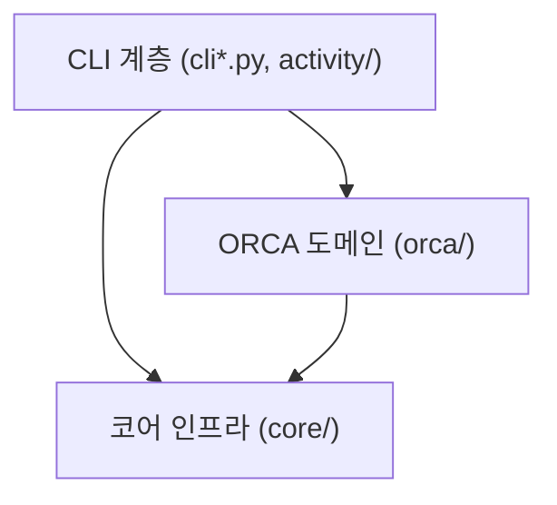

# 아키텍처 및 설계 원칙

[English](ARCHITECTURE.md) | **한국어**

ORCA_auto는 Linux 및 WSL 환경에서 단독 ORCA 양자화학 계산을 실행하고 감독하는 큐 기반 런타임입니다.

---

## 1. 핵심 설계 철학

> 한 동작을 따라가며 그 원본, 어떤 상태를 누가 바꾸는지, 결과가 어디에 남는지를 실패·취소·재개에서도 설명할 수 있다.

3장은 이 원칙을 검사되는 산출물로 바꿉니다. 모든 디스크 파일의 단일 기록 모듈과 읽는 쪽, 모든 동작의 호출 경로, 불변 조건마다 이를 강제하는 테스트, 그리고 용어집입니다. 변경은 동작 전체에서 작업 ID와 실행·generation 식별자를 연결된 상태로 유지하고, 검토에서는 바뀐 동작의 원래 근거, 상태를 쓰는 각 주체, 사용자가 확인할 결과를 짚습니다.

1. **디스크 큐 기반 영속 실행**: 작업 제출 시점에 디스크에 원자적으로 기록되어 터미널 세션이 끊기거나 시스템이 재부팅되어도 작업이 유실되지 않습니다.
2. **독립된 실행 디렉터리 격리 (`generation`)**: 동일한 작업 디렉터리에 재제출하더라도 이전 실행 기록을 덮어쓰지 않고 새로운 타임스탬프 기반 디렉터리(`generation`)에 분리하여 저장합니다.
3. **명시적 장애 기록 및 복구**: 계산 실패 시 원본 입력을 임의 수정하거나 자동으로 재시도하지 않으며, 구체적인 실패 원인을 진단하여 기록합니다.
4. **디스크 파일 중심 상태 관리**: 모든 상태와 결과의 기준 데이터는 디스크에 저장된 JSON 파일(`job_state.json`, `queue.json`)입니다. 조회는 이 파일을 직접 읽으며 별도의 파생 조회 저장소를 두지 않습니다.

---

## 2. 계층 구조 및 책임 경계

의존 방향은 엄격하게 **`CLI / UI` → `orca` (도메인) → `core` (인프라)**의 단방향 흐름을 따릅니다. 도메인 및 코어 계층은 상위 CLI 계층을 참조하지 않습니다.

```mermaid
graph TD
    CLI["CLI 계층 (cli*.py, activity/)"]
    ORCA["ORCA 도메인 (orca/)"]
    CORE["코어 인프라 (core/)"]

    CLI --> ORCA
    CLI --> CORE
    ORCA --> CORE
```

| 패키지/모듈 | 주요 역할 및 책임 |
| :--- | :--- |
| **`cli.py`, `cli_parsers.py`, `cli_handlers.py`, `cli_run_dir.py`, `cli_queue.py`, `cli_index.py`, `cli_scratch.py`, `cli_workers.py`, `cli_worker_supervision.py`** | 명령어 파싱과 명령 묶음마다 처리 모듈 하나. 닫힌 stdout 파이프는 `cli.main` 한 곳에서만 처리합니다. `cli_handlers.resolve_command_config`는 공통 명령 설정을 읽고 확인하며 빠진 것을 알립니다. `cli_run_dir`는 전체 ORCA 설정을 한 번 읽어 같은 객체를 대상 검증과 큐 제출에 전달합니다. 또한 `run-dir` 대상을 inode 하나로 고정하고, `cli_workers`는 두 번째 워커를 거부하며 `cli_worker_supervision`은 워커 프로세스 하나를 다시 시작하고 멈춥니다 |
| **`activity/`, `activity_labels.py`, `activity_rendering.py`, `terminal.py`, `terminal_table.py`** | 큐 카탈로그(`activity/_orca.catalog`), 취소 대상 규칙(`activity/_cancel.target_rows`), 출력 표시. `activity_labels`가 큐 표의 각 칸을 만들고, `activity_rendering.queue_list_table`이 `queue list` 텍스트 출력 전체를 돌려주며 `cli_queue`는 TTY용과 일반용 스타일만 고릅니다. 상태별 아이콘과 색 하나씩은 `terminal.py`에, 표시 폭 계산은 `terminal_table.py`에 있습니다. 상태 묶음은 `core/statuses.py`에 있습니다 |
| **`cli_systemd_*.py`, `systemd_plan.py`, `_process_evidence.py`** | `systemd install`, `service status`, `service restart`. 아래에서 위로 쌓이며 import-linter가 강제합니다: 유닛 계획(`systemd_plan`), 유닛 렌더링(`cli_systemd_units`), 유닛과 `/proc` 읽기(`cli_systemd_evidence`), 최신성 판정(`cli_systemd_freshness*`), 실행권 저장소 하나에 대한 유휴 전용 재시작 가드(`cli_systemd_restart_guard`), 그 위의 명령 소유 모듈(`cli_systemd_apply`, `cli_systemd_restart`, `cli_systemd_status`). `_process_evidence`는 워커가 시작한 import 출처를 기록합니다 |
| **`orca/`** | ORCA 전용 로직: 입력 파일(`.inp`) 파싱 및 자원 판별, 실행 준비, 큐 워커 및 프로세스 구동, 출력 로그 분석 및 수렴 판정, 결과 보고서(`machine.json`) 생성 |
| **`core/`** | 공용 인프라: 디스크 큐 저장소, 실행권 슬롯, 프로세스 감독과 PID 파일, 제한된 파일 I/O, 설정 탐색과 로더, 위치 인덱스 저장소, RAM scratch 워크스페이스, 알림 채널, 파일시스템 잠금 |
| **`machine_contracts/`** | 소스가 소유하는 ORCA_auto 경로용 `factory/machine-observation` v1 validator. 엔벨로프와 `chemistry/results-bundle` 스키마를 wheel에 포함하며 외부 클론이 필요 없고, `jsonschema`는 선택 extra `validation`으로 설치합니다. 모든 `machine.json`은 `orca/machine_observation`이 만들며, 이 패키지는 검증만 하고 아무것도 쓰지 않으며 `core/`·`orca/`는 이를 임포트하지 않습니다([ADR 0014](adr/0014-source-owned-machine-observation-validator.md)) |

`pyproject.toml`의 `[tool.importlinter]` 계약이 이 의존 방향과 systemd 계층을 강제하고, `make check`가 `scripts/check_imports.py`로 이를 실행합니다.

> **아키텍처 특징**: 엔진은 ORCA 하나이며, 작업 하나는 독립된 ORCA 입력 디렉터리 하나입니다. 워크플로우 계층은 없습니다([ADR 0005](adr/0005-remove-retired-workflow-support.md)).

---

큐 행은 `core/queue/persistence.entry_from_dict`에서 디스크 경계를 통과하며, 이곳에서 스키마를 검증하고 식별자·상태·우선순위를 정규화합니다. 내부에서는 타입이 정해진 `QueueEntry` 필드를 직접 읽습니다. `orca/queue/entries`는 generation 식별과 타입이 정해지지 않은 metadata 해석을 맡고, metadata 사본 함수는 원본 행을 바꾸지 않는 갱신을 보장합니다. `effective_queue_status`는 취소 요청 중인 행의 표시 규칙만 더합니다. 영속 ORCA 식별 문자열은 `orca/app_ids.py`의 상수이며 엔진 카탈로그는 없습니다.

## 3. 소유 지도

디스크 파일마다 기록 모듈은 하나입니다. `tests/core/queue/test_ownership_guards.py`는 패키지 소스를 훑어, 아래 표에 없는 곳에서 기록 함수에 닿으면 실패합니다. 소유자를 바꾸는 변경은 그 가드와 이 장을 함께 고칩니다. 경로의 `<runs_root>`는 큐 루트, `<reaction_dir>`는 작업 디렉터리, `<generation_dir>`는 그 안의 generation 디렉터리 하나입니다. "CLI"는 명령 프로세스, "부모"는 워커 부모, "자식"은 워커 자식입니다.

### 디스크 파일과 기록 주체

| 파일 | 잠금 | 기록 모듈 | 호출하는 곳 | 읽는 곳 |
| :--- | :--- | :--- | :--- | :--- |
| `<runs_root>/queue.json` | `<runs_root>/queue.lock` | `core/queue/store.mutate_entries`(→ `persistence.save_entries`). PENDING·종료 행은 `transitions.requeued_entry`와 `terminal_entry`만, 새 행은 `adapter.enqueue`만 만듦 | CLI: `adapter.enqueue`, `enqueue_publication`, `adapter.cancel`, `store.clear_terminal`. 부모: 인수(`store.dequeue_entry_if_pending`), `publication_repair`, 제출 알림 전송권 확보, `settlement`의 종료 표시와 결합, `orphans`. 자식: `adapter.requeue_running_entry`, `adapter.mark_failed`, `recovery_rebind` | `store.list_queue`(카탈로그, 워커 미리 보기, 어댑터), `store.QueueCancellationProbe`. `run_cleanup`과 의도 정리는 잠금 아래에서 읽기만 함 |
| 루트 `<reaction_dir>/job_state.json` | `run.lock` 안의 `.job_state.mutation.lock` | `orca/state.save_state`, 종료 결과는 `finalize_state` | 자식: `execution.execute_locked_run`, `attempt/run`, `attempt/resume`, `output_adoption`, `attempt/reporting.exit_with_result`. 부모: `terminal_state._record_terminal_run_state`, `notifications.claim_and_send_terminal`. CLI: `run_cleanup.clear_terminal_run_states`가 삭제(`queue list clear`) | `state_reading.load_state`, `run_snapshot.load_pinned_state`(카탈로그), `terminal_marker` fingerprint |
| generation `<generation_dir>/job_state.json` | 위와 같음 | `state.save_state` → `state.write_generation_bytes`. 검증된 generation에 실행 사실이 바뀔 때만 | 루트 상태와 같음 | `state_reading.load_generation_state` |
| `<runs_root>/.admission/admission_slots.json` | `.admission/admission.lock` | `core/admission/store.py`(`AdmissionStore`, → `persistence.save_slots`) | 부모: `reserve_slot`, `update_slot_metadata`, `release_slot`, `recover_slot_engine_process`, `recover_orphaned_engine_slots`, `reconcile_stale_slots`. 자식: `execution._child_admission_slot`(활성화, 완료, 죽은 슬롯 해제), `engine_process`의 준비·등록 함수를 거치는 runner | `read_active_slot_count`(여유 확인, `queue list`, 재시작 가드), `get_slot`(자식의 인계 대기), `list_all_slots` |
| `<runs_root>/job_locations.json` | `<runs_root>/job_locations.lock` | `core/indexing/store.py`(`_save_records`) | CLI: `queue/job_records.upsert_row_job_record`(대기), `index rebuild`(`merge_job_locations`), `index prune`. 부모: `upsert_row_job_record`(복구한 행과 실행 중 행), `settlement._publish`(`upsert_terminal_job_record`) | `run_snapshot`(`queue list clear`의 탐색), `job_locations.upsert_job_record` |
| `<runs_root>/.orca_auto_snapshot_intents/<token>.json` | `.orca_auto_snapshot_intents.mutation.lock` | `core/queue/snapshot_intent.py` | CLI: `execution_binding` 생성(작성, 결합), `submission`(enqueueing, 이어서 owned 후 폐기). 부모: 시작 전 `retire_snapshot_intent_for_row`(제출이 남긴 의도), 복구의 `reconcile_orphaned_snapshot_generations`. 자식: 대체 generation을 만드는 `recovery_rebind` | `snapshot_intent.py` 자신 |
| generation 소유자 xattr `user.orca_auto.generation_owner` | 의도 변경 잠금 | `core/queue/generation_owner.bind_direct_generation_owner` | `snapshot_intent.bind_snapshot_intent_generation_identities` | `generation_owner.require_direct_generation_owner`(`state_reading.verified_generation_artifact_target` 경유) |
| 행 메타데이터의 재처리 표식 `orca_terminal_replay` | `queue.lock`(`queue.json` 안에 있음) | 형식: `orca/queue/terminal_marker.py`. 종료 표시와 같은 변경에서 기록하고 `settlement.clear_marker`만 제거 | 부모: `adapter.mark_completed`, `mark_failed`, `mark_cancelled`, `orphans.apply_terminal_reconciliation`, `settlement.retire_marker`. 자식: 취소 시 `adapter.requeue_running_entry`, 거부된 인수에 `adapter.mark_failed`. CLI: 대기 행에 대한 `adapter.cancel` | `settlement.work_item_for_row`, `replay`, 카탈로그(`result publication pending`) |
| `<generation_dir>/machine.json`, `execution_provenance.json` | `run.lock` | `report/publication.write_report_json`(→ `state.write_generation_bytes`). `machine.json`의 모든 필드는 `machine_observation.build_machine_observation`이 만듦 | `publication.write_report_files`. 자식의 `attempt/reporting.exit_with_result`와 부모의 `terminal_state._record_terminal_run_state`가 호출 | 외부 소비자. `publication`이 종료 결과의 불변성을 확인 |
| `<generation_dir>/job_report.html`, `si_block.md` | `run.lock` | `report/publication.write_job_html_report`, `report/si.write_si_block` | `publication.write_report_files`(같은 두 호출자) | 외부 소비자 |
| `<reaction_dir>/run.lock` | 잠금 자체 | `orca/run_lock.acquire_run_lock` | 자식: `execution.execute_locked_run`, `recovery_rebind`. 부모: `terminal_state._record_terminal_run_state`, `notifications.claim_and_send_terminal` | `process_tracking.run_lock_status`를 쓰는 공유 확인: `run_status.observed_queue_status`, `orphans`, `run_cleanup`, `submission` |
| `<runs_root>/queue_worker.pid` | 워커 수명 동안 잡는 `queue_worker.pid.lock` | `core/queue/worker/pid_file.py` | 부모: 수명 잠금 아래의 `OrcaQueueWorker._write_pid_file`과 `_remove_pid_file`. PID 조회는 파일을 변경하지 않음([ADR 0011](adr/0011-read-only-pid-lookups.md)) | `orca/commands/queue.existing_worker_pid`, `submission`, `orphans` |
| RAM scratch manifest `<scratch_root>/attempt-*/.orca_auto_scratch.json` | `<scratch_root>/.orca_auto_scratch.lock` | `core/engine_scratch/_manifest._write_workspace_manifest` | 자식: `EngineScratchWorkspace.create`(`OrcaRunner.prepare`). CLI: `scratch clear`가 비활성 워크스페이스를 제거 | `engine_scratch/_inspect`(실행 전 점검, `scratch list`) |
| `<generation_dir>`로의 scratch 회수와 `.orca_auto_scratch_publication.json` 저널 | `run.lock` | `core/engine_scratch/_publication._publish_workspace` | 자식: `EngineScratchWorkspace.publish`를 거치는 `OrcaRunner` | 다음 실행의 `_recover_incomplete_publication` |
| `<runs_root>/logs/<queue_id>.log` | 없음 | `core/queue/processes.start_background_process`(자식의 stdout·stderr) | 부모: `OrcaQueueWorker._start_background_process`. CLI: `queue list clear`가 제거 | `queue list`가 경로를 표시 |
| `orca_auto.yaml` | 없음 | `orca/commands/init._write_config` | CLI: `init` | `orca/config.load_config`를 거치는 `core/config/files` 로더 |
| systemd 유닛 파일 | 없음 | `cli_systemd_apply._write_unit_files` | CLI: `systemd install` | systemd. `service status`가 실행 중인 워커와 비교 |

### 동작별 호출 경로

각 경로는 진입점부터 마지막 디스크 기록까지 이름 있는 단계를 나열합니다. `→`는 앞 단계가 호출하거나 앞 단계 다음에 실행되는 단계로 이어지고, 괄호는 그 단계가 직접 하는 호출입니다.

| 동작 | 프로세스 | 호출 경로 | 디스크 결과 |
| :--- | :--- | :--- | :--- |
| 제출 | CLI | `cli_run_dir.cmd_run_dir` → `commands/run_inp.cmd_run_inp` → `submission.submit_reaction_dir_to_queue` → `submission.create_queued_submission`(`execution_binding.build_orca_execution_snapshot`) → `enqueue_publication.run_enqueue_publication`(`adapter.enqueue`) → `job_records.upsert_row_job_record` → `snapshot_intent.mark_snapshot_intent_owned` | 바인딩된 입력과 소유자 xattr가 있는 generation 디렉터리, 발행 임대가 붙은 `queue.json` 행, 대기 상태의 `job_locations.json` 기록. 행이 확정되면 스냅숏 의도는 폐기됨. 발행이 실패하면 행을 복구 대기로 두고 워커가 복구 |
| 실행권 할당 | 부모 | `QueueWorkerLoop._fill_slots` → `OrcaQueueWorker._admit_next`(`repair_queue_publications`, `notify_queued_jobs`, `admission_has_capacity`, `roots.peek_next_entry`, `_try_reserve_admission_slot`, `roots.dequeue_next_entry`) → `_start_reserved`(`retire_snapshot_intent_for_row`) → `_start_job`(`_start_background_process`) → `_on_worker_process_started`(`update_slot_metadata`, `upsert_row_job_record`) | 슬롯이 `reserved`에서 자식 pid를 가진 `active`로, 행은 RUNNING, 의도 폐기, 실행 중 위치 기록. 인수를 놓치면 슬롯 해제 |
| 계산 | 자식 | `commands/worker_child.main` → `worker_execution.run_worker_child_job`(`maybe_rebind_recovery_generation`, `await_parent_admission_handoff`) → `process_dequeued_entry` → `execution.execute_orca_run` → `execute_locked_run`(`run.lock`, `recover_crashed_state`, `_child_admission_slot`) → `attempt/run.run_attempt`(`OrcaRunner.run`, `out_analyzer.analyze_output`) → `attempt/reporting.exit_with_result`(`write_report_files`) | 루트와 generation의 `job_state.json`, ORCA 출력, 보고서. 슬롯 활성화와 완료. scratch 용량이 부족하면 행을 `pending`으로 되돌리고, 중지되면 다시 대기시키거나 취소가 요청된 경우 재처리 표식과 함께 취소로 표시 |
| 종료 정리 | 부모 | `QueueWorkerLoop._check_completed_jobs` → `OrcaQueueWorker._finalize_completed_job`(`recover_slot_engine_process`, `settlement.mark_terminal_row`) → `_hand_off_terminal_row`(`settlement.work_item_for_row`) → `_settle_live`(`settlement.is_superseded`) → `settlement.prepare`(`terminal_state.record_failed_run_state`, `record_cancelled_run_state`) → `settlement.bind_row` → `_release_terminal_job`(`release_slot`) → `settlement.finish`(`_publish`, `retire_marker`) | 표식이 붙은 종료 행, 빠진 실패·취소 `job_state.json`과 보고서, 슬롯 삭제, 종료 위치 기록, 알림 전송권, 표식 제거. 한 단계가 실패하면 작업이나 재처리 항목을 남겨 재시도 |
| 복구 | 부모 | `OrcaQueueWorker._reconcile_worker_state` → `snapshot_intent.reconcile_orphaned_snapshot_generations` → `_release_unattached_admission_slots` → `recover_orphaned_engine_slots`, `reconcile_stale_slots` → `orphans.reconcile_orphaned_running_entries` → `replay.reconcile_terminal_replays`(`settlement.settle`) | 버려진 의도와 generation 삭제, 남은 슬롯 해제, 고아 RUNNING 행을 재대기 또는 종료로 표시, 표시된 행을 위와 같이 정리 |
| 알림 | 부모, 자식 | 접수: `_periodic_upkeep` 또는 `_admit_next` → `notifications.notify_queued_jobs`(`_claim_queued_notifications`) → `orca/notifications.dispatch_notification`. 시작: `attempt/run.run_attempt` → `dispatch_notification`. 종료: `settlement._publish` → `notifications.claim_and_send_terminal` → `dispatch_notification` | `queue.json`의 `orca_queued_notification_pending` 해제, 루트 `job_state.json`의 `finished_notification_claimed_at`. 시작 알림은 기록 없음. 전송은 아무것도 쓰지 않음 |
| 취소 요청 | CLI | `cli_queue.cmd_queue_cancel` → `activity/_cancel.cancel_activity`(`_orca.catalog`, `target_rows`) → `adapter.cancel` → `transitions.request_cancel` | 대기 행은 재처리 표식과 함께 취소되고 다음 복구 패스가 정리. 실행 중 행에는 `cancel_requested` |
| 취소 중지 | 부모, 자식 | 부모: `OrcaQueueWorker._check_cancel_requests`(`cancel_requested_ids`) → `_cancel_running_job`(`_stop_child_and_recover_engine`, 자식이 표시하지 않았으면 `adapter.mark_cancelled`) → `_hand_off_terminal_row` → `_settle_live`. 자식: `OrcaRunner.run`이 `WorkerShutdownInterrupt`를 올림 → `run_worker_child_job`(`adapter.requeue_running_entry`) | 자식의 시도·scratch 근거, 자식이나 부모가 표식과 함께 취소로 표시한 행. `job_state.json`의 취소 결과는 부모의 종료 정리만 씀([ADR 0008](adr/0008-parent-writes-the-cancelled-result.md)) |
| 조회 | CLI | `cli_queue.cmd_queue_list` → `activity/_list.list_activities` → `activity/_orca.catalog`(`adapter.list_queue`, `run_snapshot.collect_run_snapshots`) → `run_status.observed_queue_status` → `activity_rendering.queue_list_table` | 기록 없음. `queue.json`, 각 행의 루트 `job_state.json`, `run.lock` 확인, 슬롯 수를 읽음 |
| 인덱스 재구성 | CLI | `cli_index.cmd_index_rebuild` → `job_locations/_rebuild.rebuild_job_location_records` → `core/indexing/store.merge_job_locations`(`_save_records`). `index prune`: `cli_index.cmd_index_prune` → `prune_job_locations` | 디스크의 실행 상태로 `job_locations.json` 행을 추가·갱신하며 재구성은 행을 지우지 않음 |
| 정리 | CLI | `cli_queue.cmd_queue_list`(`clear`) → `activity/_clear.clear_activities` → `run_cleanup.clear_terminal_records` → `clear_terminal_run_states` → `clear_terminal_queue_entries`(`store.clear_terminal`) | 보호되지 않은 루트 `job_state.json` 삭제, 표식 없는 종료 행을 워커 로그·발행 잠금 파일과 함께 제거. generation 산출물은 보존 |

### 불변 조건 색인

| 불변 조건 | 소유자 | 강제하는 곳 |
| :--- | :--- | :--- |
| `queue.json`의 기록 주체는 하나이고, 그 밖에서는 읽을 때만 잠금을 잡는다 | `core/queue/store.mutate_entries` | `tests/core/queue/test_ownership_guards.py`(`test_queue_file_is_written_only_by_the_store`, `test_queue_lock_is_held_outside_the_store_only_by_read_only_users`) |
| PENDING·종료 행은 두 생성 함수에서만 나오고, 행은 한 번만 만들며 `enqueued_at`은 다시 쓰지 않는다 | `transitions.requeued_entry`, `terminal_entry`, `adapter.enqueue` | `test_ownership_guards.py`(`test_pending_and_terminal_rows_are_built_only_by_the_transition_constructors`, `test_rows_are_created_once_and_no_rewrite_sets_enqueued_at`) |
| generation 식별 하나가 토큰과 모든 쓰기 fence를 정한다([ADR 0006](adr/0006-one-generation-identity-for-token-and-fences.md)) | `orca/queue/entries.generation_identity` | `tests/contracts/test_rule_pins_queue.py`, `tests/orca/queue/test_entries.py` |
| 원자적 쓰기 함수는 그 파일을 소유한 모듈만 호출한다 | 위 표 | `test_ownership_guards.py::test_atomic_writers_are_called_only_by_the_module_that_owns_the_file` |
| `job_state.json`은 상태 저장 계층으로만 저장하고 generation 근거를 루트보다 먼저 쓴다 | `orca/state.save_state` | `test_ownership_guards.py::test_job_state_is_written_only_through_the_state_writer_by_its_owners`, `tests/orca/test_state.py` |
| 취소 결과는 부모의 종료 정리만 쓴다([ADR 0008](adr/0008-parent-writes-the-cancelled-result.md)) | `terminal_state.record_cancelled_run_state` | `test_ownership_guards.py::test_only_the_parent_settlement_records_a_cancelled_result`, `tests/orca/queue/test_settlement_faults.py`, `tests/orca/test_worker_execution.py::test_cancelled_child_leaves_the_cancelled_result_to_the_parent` |
| `machine.json`과 보고서는 발행 모듈이 만들고 쓰며, 종료 보고서는 불변이다 | `report/publication.write_report_files`, `machine_observation.build_machine_observation` | `test_ownership_guards.py::test_machine_json_and_reports_are_written_only_by_the_publisher`, `tests/orca/test_state.py::test_terminal_machine_observation_is_immutable`, `tests/contracts/test_report_outputs.py` |
| `runs_root` 아래 실행권 저장소 하나, 한도는 `scheduler.max_active_simulations`([ADR 0007](adr/0007-one-admission-store-under-runs-root.md)) | `core.admission.admission_dir` | `tests/contracts/test_rule_pins_admission.py::test_admission_resolution`, `tests/orca/queue/test_worker_start.py::test_worker_roots_and_limit_match_the_rendered_unit` |
| 슬롯은 저장소만 쓰고 각 변경은 그 소유자에서만 오며, 자식은 슬롯 규칙 하나를 따른다 | `core/admission/store.py`, `execution._child_admission_slot` | `test_ownership_guards.py`(`test_admission_slots_are_written_only_by_the_store_for_their_owners`, `test_only_the_worker_reconcile_lists_slots_with_a_rewrite`), `tests/contracts/test_rule_pins_admission.py::test_child_slot_outcome` |
| 행을 인수하기 전에 슬롯을 예약하고, 인수에 실패하면 해제한다 | `OrcaQueueWorker._admit_next` | `tests/orca/queue/test_worker_admission.py`(`test_admission_pass_reserves_the_slot_before_it_claims_the_row`, `test_admission_pass_releases_the_slot_when_the_claim_fails`) |
| 한 generation에서 ORCA는 최대 한 번 실행되고, 재개는 재바인딩으로만 한다([ADR 0009](adr/0009-resume-only-by-rebind.md)) | `recovery_rebind.maybe_rebind_recovery_generation`, `attempt/run.run_attempt` | `tests/orca/test_recovery_rebind.py::test_rebind_moves_crashed_claim_into_new_generation`, `tests/orca/attempt/test_single_attempt_contract.py` |
| 종료 정리는 실시간과 재처리에서 같은 순서로 쓰고, 실패한 단계는 재시도한다 | `orca/queue/settlement.py` | `tests/orca/queue/test_settlement_faults.py::test_settlement_fault_matrix`, `tests/contracts/test_rule_pins_replay_retry.py`, `tests/contracts/test_durable_files.py`의 `effects.json` 골든 |
| fail-closed 판정 하나가 종료 generation이 아직 디렉터리를 소유하는지 정한다 | `terminal_marker.terminal_generation_verdict` | `tests/contracts/test_rule_pins_replay.py::test_replay_supersession_truth_table` |
| `job_locations.json`은 작업 기록 투영과 `index` 명령으로만 쓴다 | `core/indexing/store.py`, `queue/job_records.py` | `test_ownership_guards.py::test_location_index_is_written_only_through_job_records_and_index_commands` |
| 큐 명령은 큐 행과 각 행 자신의 상태만 읽는다([ADR 0010](adr/0010-queue-commands-read-queue-rows.md)) | `activity/_orca.catalog` | `tests/activity/test_orca_discovery.py::test_listing_reads_neither_the_location_index_nor_the_run_tree`, `tests/activity/test_orca.py::test_catalog_joins_queue_rows_with_their_own_state_only` |
| 알림은 세 곳에서만 보내고 전송권은 최대 한 번 확보한다 | `orca/queue/notifications.py`, `attempt/run.run_attempt` | `test_ownership_guards.py::test_notifications_are_dispatched_only_from_the_three_claim_sites`, `tests/orca/queue/test_notifications.py` |
| 워커가 자신의 PID 파일을 쓴다 | `OrcaQueueWorker._write_pid_file` | `test_ownership_guards.py::test_worker_pid_file_is_written_only_by_the_worker`, `tests/core/queue/test_worker.py::test_worker_pid_file_handles_live_stale_dead_missing_and_invalid_pids` |
| 폴링 패스 하나가 실패해도 실행 중인 자식의 감독은 멈추지 않는다 | `QueueWorkerLoop.run` | `tests/core/queue/test_worker.py::test_queue_worker_loop_keeps_supervising_after_a_failed_poll_pass` |
| 규칙 하나가 입력의 route를 분류해 완료 판정, 보고서, SI 블록에 쓴다 | `completion_rules.route_facts` | `tests/orca/test_completion_rules.py::test_route_facts_classify_every_route_line_and_the_scan_block`, `tests/contracts/test_rule_pins_analysis.py` |
| 도메인과 코어는 CLI 계층을 import하지 않고, systemd 모듈은 계층을 지킨다 | `pyproject.toml`의 `[tool.importlinter]` | `make check`의 `scripts/check_imports.py`, `tests/tooling/test_cli_layer_contract.py` |
| 공개 디스크 파일, CLI 문서, 보고서 바이트는 의도한 변경에서만 바뀐다 | `tests/contracts/golden/` | `tests/contracts/test_durable_files.py`, `test_cli_documents.py`, `test_report_outputs.py` |

### 용어집

| 용어 | 뜻 | 코드 이름 |
| :--- | :--- | :--- |
| runs root, allowed root, 큐 루트 | 같은 디렉터리 하나. `queue.json`, `job_locations.json`, `.admission/`, `logs/`, 스냅숏 의도, PID 파일이 있고 모든 작업 디렉터리가 그 아래에 있음 | 설정 키 `runs_root`, `cfg.runtime.allowed_root`, `orca/queue/roots.queue_root(cfg)` |
| reaction 디렉터리, 작업 디렉터리 | 사용자가 제출한 디렉터리. `reaction_dir`는 큐 행이 대조하는 저장 키이자 `queue list --json`이 출력하는 필드이고, `job_state.json`은 같은 경로를 `job.dir`로, `run-dir`는 `job_dir`로 표시함 | 행 메타데이터 `reaction_dir`, `RunExecutionContext.reaction_dir` |
| generation(큐 행) | 작업의 제출 한 번. 생명주기 메타데이터를 뺀 행의 식별이며 `job_state.json`이 그 해시를 기록함 | `entries.generation_identity`, `queue_entry_generation_token`, 상태의 `queue_generation` |
| generation 디렉터리 | `<reaction_dir>/<YYYYMMDD-HHMMSS-8hex>`. 실행 한 번의 바인딩된 입력, 출력, 보고서 | `core/queue/generation.new_visible_generation_name`, 스냅숏의 `execution_dir` |
| 디렉터리 소유자 | generation 디렉터리를 그 의도에 묶는 소유자 xattr. 재처리에서는 디렉터리마다 종료 행을 정리할 generation 하나 | `generation_owner.py`, `replay._select_generation_owner` |
| 실행 스냅숏 | 바인딩된 입력, 식별 정보, 자원, 실행 파일을 담은 행의 기록. 인수할 때 검증함 | 행 메타데이터 `execution_snapshot`, `execution_binding` |
| 스냅숏 의도 | enqueue 전 기록(creating, enqueueing, owned). 어느 행도 소유하지 않는 generation을 복구가 지울 수 있게 함 | `core/queue/snapshot_intent.py` |
| 실행 스냅숏 조회(run snapshot) | 목록과 정리를 위해 작업 디렉터리의 루트 상태를 고정 핸들로 읽은 것 | `run_snapshot.collect_run_snapshots` |
| 실행권 슬롯, 실행권 토큰 | `admission_slots.json`의 행 하나(`state`, `engine_process_state`). 토큰은 `--admission-token`으로 자식에 전달됨 | `AdmissionSlot`, `reserve_slot`, `RunExecutionContext.admission_token` |
| 재처리 표식 | 종료 표시와 함께 쓰는 행 메타데이터. 부모가 아직 해야 할 일(상태, 보고서, 인덱스, 알림)이며 제거될 때까지 같은 디렉터리의 다음 제출을 막음 | `orca_terminal_replay`, `terminal_marker.py`. 부수 효과 없는 fence: `orca_terminal_replay_fence_only` |
| 종료 정리(settlement) | 종료 표시된 행에서 결과 발행까지의 부모 단계: 표시, 준비, 결합, 슬롯 반환, 마무리. 실시간 또는 재시작 재처리 | `orca/queue/settlement.py`, `OrcaQueueWorker._settle_live`, `replay.reconcile_terminal_replays` |
| 대체(supersession) | 디렉터리 상태가 더 새로운 실행으로 넘어간 종료 generation. 아무것도 쓰지 않고 표식만 제거함 | `terminal_generation_verdict`, `settlement.is_superseded` |
| 대기 기록 발행 | 새 행의 대기 위치 기록을 임대 아래에서 발행하는 것. 실패하면 워커가 복구 | `enqueue_publication.py`, `publication_repair.py` |
| 종료 발행 | 종료 정리 뒤의 인덱스 기록, 알림 전송권, 표식 제거. `result publication pending`으로 표시됨 | `settlement.finish`, 범위 `orca_terminal_publication` |
| scratch 회수 | RAM scratch 출력을 저널과 함께 generation 디렉터리로 옮기는 것 | `engine_scratch/_publication.py` |
| 위치 인덱스 | `job_locations.json`. 각 작업이 실행된 위치이며 디스크에서 재구성할 수 있고 `queue list`는 읽지 않음. 예전 SQLite activity 투영은 제거됨 | `core/indexing`, `orca/job_locations`, `index rebuild` |
| 재바인딩 | 실행 시작 근거가 있는 generation의 인수를 실행 전에 새 generation으로 옮기는 것 | `recovery_rebind.maybe_rebind_recovery_generation` |

---

## 4. 작업 제출 및 실행 수명 주기 (Lifecycle)

### 1. 제출
- `orca_auto run-dir <PATH>` 실행 시 `orca/submission.py`가 디렉터리 내 최신 `.inp` 파일과 자원 설정(`%pal`, `%maxcore`)을 파싱합니다.
- 입력 파일 및 종속 파일의 스냅샷을 구성하고, 큐에 작업을 등록한 후 CLI는 즉시 반환됩니다.

제출 스냅샷의 `source_inputs`에는 원본 경로, SHA-256 해시, 바이트 수가 기록됩니다. 제출은 선택한 `.inp`를 한 번만 읽습니다. 큐 항목의 작업 종류, 분자 식별자, 좌표 파일 경로, 자원 요청과 `source_inputs`의 해시, 바인딩된 복사본은 모두 이 바이트를 기준으로 하므로 제출 도중 파일이 다시 저장되어도 서로 어긋나지 않습니다. 제출 계층이 자원 지시어 보완과 generation 내부 참조 경로 변경을 맡습니다. `resource_request`는 확정된 자원 요청을, `bound_selected_identity`는 ORCA에 전달할 실제 `.inp`를 식별합니다. 참조 파일은 `source_inputs`와 `materialized_inputs`에서 같은 역할 키로 연결됩니다. 모두 접수 시점의 정보이며, `runtime_mutable_input_roles`는 엔진이 덮어쓸 수 있는 복사본을 구분하고 장애 복구 시 `recovery`는 이전 generation과 복구에 사용한 파일의 식별 정보를 보존합니다. 실행은 이 근거를 독립된 복사본으로 `job_state.json`의 `engine_payload.execution_provenance`에 전달하며, 나중의 원본 파일을 다시 읽어 당시 출처를 추정하지 않습니다. 생성, 인수 시점 검증, 장애 복구, 정리는 모두 `orca/execution_binding/_snapshot_identity.py`의 한 규칙 집합(버전 확인, 의존 파일 역할 이름, 내용 식별자, 자원 요청, 디렉터리 식별)으로 스냅샷을 읽습니다. 따라서 네 경로는 같은 스냅샷을 받아들이고 같은 스냅샷을 거부합니다.

정상 제출과 발행 복구는 디스크 큐 항목을 같은 `queue/job_records.py`에 전달하고, 워커도 인수한 행을 같은 투영(`upsert_row_job_record`)으로 실행 중 기록에 남깁니다. 이 모듈은 generation의 종료 상태에서 종료 위치 기록도 투영합니다. 선택 입력과 자원은 접수 당시 메타데이터에서 읽고, 과거 항목의 요청 정보가 비었으면 스냅샷의 자원과 설정 기본값 순서로 보완합니다. 실제 자원 정보가 비었으면 확정된 요청을 사용합니다. 접수 당시 작업 종류·분자 식별자가 없으면 `other`/`unknown`으로 표시합니다. 위치 기록을 다시 만들기 위해 변경 가능한 입력 파일을 다시 읽지 않습니다.

### 2. 디큐 및 자원 할당
- 백그라운드 상주 워커 데몬이 큐를 주기적으로 확인합니다.
- 발행 복구는 디스크 큐 항목을 원본으로 대기 작업의 위치 기록을 만듭니다. 다른 발행자가 잠금을 잡고 있거나 인덱스 저장이 실패하면 해당 항목을 보류하고, 준비된 다른 작업에 가용 슬롯을 할당합니다. 발행 상태가 `complete`여도 경로 검증이나 안전 차단 기록이 실패한 항목은 이번 할당에서 제외합니다. 다음 할당 시 다시 검사·복구하며, 큐 원본을 읽을 수 없으면 실행을 보류합니다.
- 실행 가능한 작업이 발견되면 워커가 하나뿐인 실행권 저장소 `<runs_root>/.admission`([ADR 0007](adr/0007-one-admission-store-under-runs-root.md))의 슬롯(`scheduler.max_active_simulations`)을 확인해 하나를 예약하고 계산 자식 프로세스를 실행합니다.
- RAM Scratch를 사용하면 자식이 실행 상태를 기록하기 전에 scratch 워크스페이스를 예약하며, 이때 호스트 메모리와 tmpfs 여유분을 검사합니다([ADR 0004](adr/0004-concurrent-ram-scratch-under-a-summed-memory-guard.md)). 여유가 일시적으로 부족하면 작업을 실패 처리하지 않고 대기(`pending`) 상태로 되돌리며, `queue list`에는 자원 대기로 표시됩니다. 그렇지 않으면 격리된 실행 디렉터리(`generation`)에서 ORCA를 구동합니다.

### 3. 실행 감독 및 복구
- 워커는 자식 프로세스의 상태를 추적하며, 외부 시그널(SIGTERM) 수신 시 프로세스를 정리하고 정상 종료합니다.
- 워커 종료나 워커 유실로 중단된 실행은 큐 행이 `pending`으로 돌아가고, 다음 인수는 완료 출력으로 마무리되지 않는 한 실행 전에 새 generation으로 재바인딩됩니다([ADR 0009](adr/0009-resume-only-by-rebind.md)). 실패한 실행은 큐 항목과 generation 상태 모두에 구체적인 실패 원인을 남깁니다.

### 4. 상태 확정 및 결과 저장
- ORCA 계산이 끝나면 `orca/out_analyzer.py`가 출력 파일을 한 번 줄 단위로 읽으며 정상 종료 배너 및 오류/미수렴 마커를 분석하고, TS route이면 같은 읽기에서 마지막 진동수 구간의 허수 모드를 셉니다. (입력 echo나 주석에 포함된 오류 문구는 제외)
- 검증된 계산 데이터(에너지, 수렴 여부, 열역학 데이터 등)를 바탕으로 다운스트림 도구 연동을 위한 표준 `machine.json`(v1 Envelope 규격) 및 HTML 요약본을 생성합니다. `machine.json`의 모든 필드(엔벨로프, lifecycle, artifact 영수증, 결과 요약)는 `orca/machine_observation.py`가 정규화된 작업 상태와 generation 파일에서 만들고, `report/publication.py`는 이를 HTML·SI 파일과 함께 기록하며, IRC 검증 블록을 포함한 모든 SI 블록은 `report/si.py`가 렌더링합니다.

원본 근거가 기록된 결과는 `machine.json`보다 먼저 `execution_provenance.json`을 발행합니다. 보고서 발행자는 generation에 기록된 근거를 복사하고, 기계 결과는 `input`, `orca-output`과 함께 `execution-provenance` artifact로 이를 참조합니다. 영수증은 어느 읽는 쪽이든 검증할 수 있고, generation 상태와의 일치는 릴리스 smoke가 확인합니다. 종료 보고서와 그 출처 파일은 불변이며, 종료 처리를 재실행해도 출처 artifact가 없는 과거 보고서를 포함해 당시의 근거를 유지합니다.

선택된 입력의 작업 종류는 규칙 하나로 정합니다. `completion_rules.route_facts`가 `.inp`를 읽어 route 줄과 플래그(TS, IRC, NEB-TS, 전체·부분 최적화, relaxed scan(`%geom Scan` 블록이 있는 최적화), 비정류 경로·동역학)를 기록합니다. 분석기의 완료 모드, HTML 보고서 구성(`report/composer.py`), 구조 종류(`evidence.structure_kind`), SI 작성(`report/si.py`)이 모두 이 기록에서 나오므로 같은 입력을 서로 다르게 분류할 수 없습니다. 입력은 호출하는 쪽마다 직접 읽습니다. 완료 모드, HTML 작성기, SI 작성기가 각각 `route_facts`를 호출하고, relaxed scan 보고서는 scan 좌표를 얻으려고 입력을 한 번 더 읽습니다. 작업 유형 표시(`job_type.detect_job_type`)와 입력이 요청하는 실행 산출물 판정(`execution_binding/_inputs.py`)은 같은 키워드 규칙에 자체 규칙 몇 개를 더해 route 줄을 따로 분류합니다. 보고서 조립기는 작업 상태로부터 페이지마다 `ReportHeader` 하나(제목, 상태와 사유, route 줄, 시각, 마지막 출력)를 만들어 Opt, SP, relaxed scan, NEB-TS, IRC 각 구성 요소의 수집기에 넘깁니다. 각 구성 요소는 두 가지 사실로 `ReportComponent` 하나(종류 이름, 배지, 메타 줄, 지표 카드, 섹션)를 만듭니다. 하나는 주 구성 요소인지 여부로, 주 구성 요소가 페이지 이름을 정하고 attempt 기록을 혼자 싣습니다. 다른 하나는 IRC 구성 요소가 있는지 여부로, 있으면 진동 요약을 IRC 쪽이 보여 줍니다. IRC 구성 요소 자신은 대신 다른 구성 요소가 최적화 추이를 이미 보여 주는지를 받습니다.

기하 제약, 고정·강체 fragment, 수소만 최적화하거나 수소를 고정하는 설정, `RigidBodyOpt`는 최적화 좌표를 제한합니다. 이런 제약이 있는 비-TS 최적화는 부분 최적화로 분류하고 전체 표면의 최소점이라고 주장하지 않습니다. 빈 제약 블록과 명시적으로 false인 수소 설정은 제약으로 보지 않습니다. 이런 제약이 있는 TS 탐색은 TS 탐색으로 남지만(TS 완료 조건, `TS` 페이지, TS SI 레코드) `completion_rules.geometry_scope`는 `partial` 범위를 줍니다. `machine.json`은 정류점을 `unverified`로 두고, HTML 보고서와 SI 블록은 허수 모드 1개를 기대대로라고 표시하지 않고 "constrained TS search: first-order saddle unverified"라고 씁니다. `machine_observation`, `evidence`, 조립기, Opt 구성 요소, SI 작성기가 이 함수 하나를 읽고, 테스트 검증기는 규칙을 독립적으로 따로 가집니다. 릴리스 smoke의 테스트 검증기는 생성기와 독립적으로 SHA-256과 바이트 수를 계산합니다.

완료 분석기의 모드는 실제 판정 조건이 다른 sp/opt/ts만 구분합니다. IRC·진동수 요구는 별도 플래그이며, scan·경로·동역학 등 보고용 분류는 RouteFacts에 남습니다. 서비스 Python 경로는 systemd 설치 계획을 만들 때 한 번 결정하고, 렌더링·경고·적용 단계가 같은 값을 사용합니다.

| 작업 종류 | HTML 보고서 구성 요소(페이지 종류) | SI 블록(완료된 작업) |
| :--- | :--- | :--- |
| NEB-TS, ZOOM-NEB-TS | NEB-TS (`NEB-TS`) | TS 구조 |
| Relaxed scan: `%geom Scan` 블록이 있는 최적화 | Relaxed scan (`Relaxed scan`) | 없음 |
| OptTS | Opt (`TS`). 제약이 있으면 제약된 TS 탐색 경고 추가 | TS 구조. 제약이 있으면 1차 안장점 미검증 경고 |
| 전체 최적화: `Opt`, `TightOpt`, `COpt` 등 | Opt (`Opt`) | 최소점 구조 |
| 부분 최적화: `OptH`, `MECP-Opt`, 제약이 있는 `Opt` 등 | Opt (`Partial Opt`) | 최소점·TS 주장이 없는 구조 |
| `IRC`가 붙은 모든 종류 또는 `IRC` 단독 | IRC 구성 요소 추가. NEB-TS나 relaxed scan이 없으면 IRC가 페이지 이름(`IRC`)을 정함 | 대신 IRC 검증 요약 |
| 일반 NEB / NEB-CI, MD | 보고서 없음 | 없음 |
| 단일점, `Freq` 단독, 그 밖의 입력 | SP (`SP`) | 최소점·TS 주장이 없는 구조 |

### 결과 발행과 큐 종료 처리

자식은 실행 상태와 generation 보고서를 발행합니다. 자식이 종료되면 부모는 엔진 종료·복구를 확인하고, 디스크의 복구 표식을 기준으로 큐 generation을 정리합니다. 완료·실패한 자식의 행은 부모가 직접 표시합니다(`mark_terminal_row`). 취소된 행은 자식이 SIGTERM을 처리하면서 표시합니다. `requeue_running_entry`는 취소 요청이 있는 행을 큐로 돌려보내지 않고 복구 표식과 함께 취소로 표시합니다. 자식이 표시하지 못하고 끝난 경우(예: 먼저 강제 종료된 경우)에는 부모가 `mark_cancelled`로 표시합니다. 어느 쪽이든 부모는 이어서 행을 정리합니다. 누락된 실패·취소 근거를 확정하고, 이 근거에 큐의 실제 결과와 실행 식별자를 결합하고, 슬롯을 반환한 뒤 발행을 마무리합니다. 취소된 자식은 종료 결과를 쓰지 않습니다. 쓰기 전에 강제 종료된 자식을 포함해, 취소 결과는 부모의 근거 확정 단계(`terminal_state.record_cancelled_run_state`)만 씁니다([ADR 0008](adr/0008-parent-writes-the-cancelled-result.md)). 종료 코드가 0이어도 해당 작업의 종료 상태가 있어야 하며, 종료 코드만으로 결과를 대신하지 않습니다.

부모는 준비된 항목을 복구 담당 목록에 넘긴 뒤 실행 슬롯을 반환합니다. 그다음 위치 인덱스 발행, 한 번의 알림 전송권 확보, 복구 표식 제거 확인을 수행합니다. `orca/queue/settlement.py`가 generation 하나에 대한 각 단계를 평평한 함수 하나로 두며, 순서는 종료 표시(`mark_terminal_row` 또는 위의 취소 표시), 준비, 결합(`bind_row`), 슬롯 반환, 마무리입니다. 정상 셧다운이 멈춘 취소를 포함해 워커의 실시간 종료·취소는 작업을 놓기 전에 슬롯 반환 앞뒤로 이 함수들을 호출하고, `replay.py`의 재시작 파이프라인은 워커가 죽기 전에 표시된 행에 대해 `settle`로 준비, 결합, 마무리를 호출하므로 두 경로의 디스크 쓰기 순서가 같습니다. 인덱스 저장이나 표식 제거가 실패하면 복구 항목을 남겨 같은 폴더의 다음 제출을 보류하고, 준비된 다른 작업은 반환된 슬롯을 사용할 수 있습니다. 디스크의 큐 표식으로 새 워커도 이어받으며 계산을 다시 실행하지 않습니다. 엔진 복구·상태 확정·슬롯 반환이 실패하면 감독 중인 작업을 유지해 재시도합니다. 발행 복구는 주기적으로 재시도하고, 알림 전달은 best-effort 방식입니다.

종료 복구 표시는 `queue list`에도 반영됩니다. 실행의 종료 상태는 유지하고 상세에 `result publication pending`을 표시합니다. `publication_blocked_scope=orca_terminal_publication`, 사유·다음 조치, `publication_owner=orca_queue_worker`가 남은 발행 책임을 설명하며, 이 값들은 `orca/queue/terminal_marker.py`가 정의합니다. 행이 필터로 숨겨져도 해당 폴더의 차단 근거는 `admission_blockers`에 남습니다. 잘못된 표시는 자동 복구를 약속하지 않고 점검을 안내하며, 유효한 복구 표시가 제거되면 발행 대기 표시도 사라집니다.

### 상태 파일의 책임

| 파일 | 원본과 용도 | 변경 책임 |
| :--- | :--- | :--- |
| 작업 루트의 `job_state.json` | 현재 작업·실행의 식별자와 실행 상태, 부모가 사용하는 알림 처리 기록 | 자식 실행기 또는 부모의 복구·알림 처리가 호출하는 `orca/state.py` |
| generation의 `job_state.json` | 해당 실행의 근거와 결과 검증에 쓰는 기록 | 같은 상태 저장 계층이 generation 소유권을 검증한 뒤 실행 사실이 바뀔 때만 갱신 |
| `job_state.json`의 취소 `final_result` | 실행 중 취소된 generation의 종료 결과 | 워커 부모만: 취소된 행을 실시간 또는 재시작 재처리로 정리할 때 `run.lock` 아래의 `queue/terminal_state.record_cancelled_run_state`. 자식은 시도·scratch 근거만 씁니다([ADR 0008](adr/0008-parent-writes-the-cancelled-result.md)) |

상태 저장 계층은 루트의 변경 잠금 안에서 바뀐 generation 근거를 먼저 저장하고 현재 루트를 갱신합니다. 알림 전송권·전송 완료 표식은 루트의 운영 기록이며, 새로 쓰는 generation 상태에서는 제외합니다. 실행 사실이 같으면 generation의 바이트와 `updated_at`을 유지하고 루트의 갱신 시각만 바뀔 수 있습니다. 따라서 같은 종료 처리를 반복해도 실행 이력을 다시 쓰지 않습니다. 과거 generation에 들어 있는 알림 표식은 계속 읽을 수 있고, 실행 사실이 같으면 그대로 둡니다.

두 파일은 순서대로 교체하며 하나의 원자적 트랜잭션은 아닙니다. generation 저장이 실패하면 루트는 그대로 두고, 루트 저장이 실패하면 먼저 저장된 generation 근거를 보존한 채 오류를 알립니다. 같은 실행 상태를 다시 저장하면 generation을 다시 쓰지 않고 루트를 갱신합니다. 소유권이 확인된 generation의 기존 상태를 읽을 수 없으면 두 상태 파일의 교체를 거부합니다. `queue list clear`는 정리 가능한 루트 상태를 제거하고 generation 산출물은 보존합니다.

### 워커의 책임과 자식 실행
워커는 감독과 실행을 분리합니다.

`OrcaQueueWorker`(`orca/queue/worker.py`)는 단일 큐 워커 서비스입니다. PID 파일과 단일
실행 잠금의 수명주기, 실행 슬롯 예약(행을 ID로 인수하기 전에 슬롯을 먼저 예약하며,
미리 읽은 행을 `expected_entry`로 사용), 자식 프로세스 구동 및 슬롯 연결, 종료 확정, 취소,
셧다운, 고아 행 정리를 총괄합니다. `_admit_next`는 실행권 할당(admission) 절차를 순서대로
수행합니다: 보류 디렉터리 확인, 발행 복구, 제출 알림, 가용 슬롯 확인, 미리 보기, 슬롯 예약,
ID 기준 인수, 인수 실패 시 슬롯 해제 순입니다. 기반 클래스 `core.queue.worker.loop.QueueWorkerLoop`는
루프 순서(회수, 취소, 수용, 대기), 셧다운 sweep, 시그널 핸들러를 관리하며 작업을
프로세스 기반 레코드로만 다룹니다. ORCA 워커는 대기 직전에 `_periodic_upkeep`을
실행합니다. 제출 알림을 보낸 뒤, 정리 주기가 되었고 종료 확정 재시도를 기다리는 회수
작업이 없으면 복구 패스를 실행합니다. 따라서 한 번의 폴링 패스는 회수, 취소, 수용,
주기 작업, 대기 순으로 진행됩니다. 특정 패스에서 일반 예외가 발생하면 로그를 남긴 후 다음
폴링 간격에 해당 패스를 재시도하며, 실행 중인 자식 프로세스는 계속 감독합니다. `KeyboardInterrupt`,
`SystemExit` 및 초기화 실패 시에는 워커를 즉시 종료합니다. 테스트는 워커의 `_start_background_process`와
`sleep_fn`을 교체하고, 설정 탐색·`/dev/shm`·인수는 `tests/conftest.py`의 공용 fixture로
다룹니다([DEVELOPMENT](DEVELOPMENT.ko.md)). 별도의 의존성 주입 프레임워크 없이 동작합니다. 부모 진입점은
`python -m orca_auto.orca.commands.queue --config …`이며, 자식 진입점은
`python -m orca_auto.orca.commands.worker_child --config … --queue-root …
--queue-id … [--admission-token …]`입니다.

부모 또는 자식 프로세스가 비정상 종료된 후의 복구는 워커가 수행합니다. 복구 패스
`_reconcile_worker_state`는 시작할 때와 그 뒤 최대 1분에 한 번 실행되며 다음 단계를
순서대로 수행합니다: 버려진 스냅숏 의도 정리(주기가 된 경우), 워커가 예약 후
작업에 연결하지 못한 슬롯 해제(실패한 할당 패스가 남긴 슬롯), 프로세스가 종료된
슬롯의 엔진 기록 복구, 큐 1회 조회, 오래된 슬롯 정리(활성 슬롯이 보유한 큐
ID를 먼저 취합), 고아 RUNNING 행 정리, 그리고 해당 큐 조회나 이전 패스 이후
관찰된 모든 종료 전이를 재처리하는 `replay.reconcile_terminal_replays`입니다.
generation 소유자가 모호하거나 후속 처리가 실패하여 재처리하지 못한 전이는
재처리 상태의 `retry_keys`에 남아 다음 패스에서 다시 시도하며, 최초 관찰 시점부터
이미 종료 상태였던 행은 재처리하지 않습니다.

취소 여부 확인은 변경되지 않은 큐 스냅샷을 재사용합니다. 실행을 마친 자식은 종료 상태와 보고서를 발행한 뒤 종료하고, 취소된 자식은 결과를 부모에게 넘깁니다. 부모가 큐의 종료 처리를 정리하고 작업·실행 ID가 일치하는 상태에서 완료 알림의 전송권을 기록합니다. 부모의 두 전송권 확보, 즉 디스크 큐 행의 접수 알림과 `job_state.json`의 종료 알림은 모두 `orca/queue/notifications.py`가 처리합니다. 동시 전송 수가 제한된 백그라운드 전송기는 확보한 메시지만 전달하며, 실행 슬롯을 점유하거나 전송 후 상태를 다시 쓰지 않습니다. 종료 처리를 반복해도 이미 전송권을 기록한 알림은 건너뛰며, 과거 전송 완료 표식도 인식합니다. 알림은 참고용이므로 전송권 기록 뒤 프로세스가 중단되거나 전송 실패·용량 부족이 발생하면 유실될 수 있고, 이를 재시도하거나 계산 결과를 변경하지 않습니다. 제출 시에는 디스크 큐 항목에 `orca_queued_notification_pending`을 기록합니다. 위치 기록 발행 후 부모 워커가 큐 잠금 내에서 전송권을 확보하고 제출 알림을 별도로 전달하므로 CLI가 종료되어도 전송 의도는 보존됩니다. 이 표시가 없는 과거 항목의 알림을 소급 전송하지 않습니다. 자식은 실행 중 상태를 저장한 뒤 시작 알림을 별도로 전달하고 ORCA를 구동합니다. 세 알림은 동일한 전송기를 사용하며 동시 전송 수는 프로세스당 4개로 제한됩니다. 전송 실패나 프로세스 종료로 참고용 메시지가 유실될 수 있으며, 전송기는 실행 상태를 변경하지 않습니다. 제출 알림 전송권 기록이 실패해도 전송만 건너뛸 뿐 실행권 할당은 정상 진행됩니다.

`core/queue`의 모듈 이름은 해당 모듈을 실행하는 프로세스에 대응합니다. `worker/`(루프,
자원 확인, PID 파일) 및 `processes.py`(자식을 독립 세션으로 구동하고 프로세스 그룹을
중지)는 부모 워커에서 실행되며, `child.py`(셧다운 표시 및 부모의 슬롯 연결 대기)는 워커
자식에서 실행됩니다. 워커 자식도 `processes.py`를 통해 셧다운 신호 처리기를 등록하고
ORCA 프로세스 그룹을 중지합니다. `snapshot_intent.py`(큐 등록 전 의도 기록)와
`generation_owner.py`(generation 디렉터리의 소유자 xattr 및 핸들 기반 정리)는
generation을 생성, 인수, 복구하는 모든 프로세스가 공통으로 사용합니다.

워커 CLI는 설정 로드, PID 확인(`core/queue/worker/pid_file.py`의 `read_worker_pid_file`을
사용하는 `existing_worker_pid`), ORCA 워커 생성 및 실행을 직접 수행합니다. `orca_auto queue worker`도
동일한 `existing_worker_pid`로 중복 워커 실행을 거부한 뒤, `cli_worker_supervision.py`가 해당 워커
프로세스를 감독합니다. 종료 시 자동으로 재시작하되, 시작 후 5초 이내 실패 종료가 2회 연속
발생하거나 300초 이내 3회 종료되면 재시작을 중단합니다. SIGTERM 수신 시에는 `worker_stop_budget_seconds`
동안 정상 종료를 대기한 뒤 강제 종료합니다. `systemd install`은 동일한 제한 시간으로 `TimeoutStopSec`을 렌더링합니다. `orca/queue/roots.py`는 단일 큐 루트
(`runtime.allowed_root`)를 해석하고 행 조회와 ID 기준 fenced 인수를 처리하며, 큐 선두
위치 기반으로 행을 무조건 인수하지 않습니다.
`orca/queue/entries.py`는 ORCA 행 식별자와 단일 generation 식별자를 관리합니다. 쓰기
fence, 발행 fence, 취소 확인, 인수는 모두 `generation_identity`를 비교하고 각자 필요한
상태 조건만 추가로 검사합니다. 수명주기 메타데이터(대기 연기 사유, 실행 ID, 재처리 표식 및 fence,
제출 알림 전송권, 발행 임대)는 식별자에 포함되지 않으며, `job_state.json`의
`queue_generation`은 그 해시값입니다.
`queue.json`은 `core/queue/store.py`의 `mutate_entries`만 수정할 수 있으며, 재대기 및 종료 행은 모두
`core/queue/transitions.py`의 `requeued_entry`와 `terminal_entry`로만 생성합니다.
`tests/core/queue/test_ownership_guards.py`가 이 불변 조건을 검증합니다.
`queue/settlement.py`는 종료 정리 단계(작업 항목 준비, 종료 표시, 준비, 결합, 발행, 표식
제거)를, `queue/replay.py`는 재시작 재처리 파이프라인(정리할 종료 행과 디렉터리별
소유 generation 결정)을 담당하며, 둘 다 상태를 명시적인 인자로 전달받습니다.
`queue/terminal_marker.py`는 영속 재처리 표식 형식, 표식이 기록하는 상태 fingerprint,
그리고 종료 generation이 여전히 디렉터리 상태를 소유하는지 판정하는 fail-closed 규칙
`terminal_generation_verdict`를 제공합니다. 재처리 사전 확인(`settlement.is_superseded`)은
이 판정에 따라 generation을 건너뛸지 결정하고, `run.lock` 아래에서 종료 `job_state.json`을 기록하는
`queue/terminal_state.py`는 갱신 여부를 판정합니다. 각 경로는 선택한 큐 행과 작업 식별자를 전용 어댑터에 전달합니다.
종료 근거를 확정한 뒤 실행 슬롯을 해제하며, 후속 결과 발행은 복구 표식으로 동일 디렉터리를 보호하면서 재시도합니다. RUNNING 행 정리는 워커가 소유합니다:
제출 프로세스는 큐 전체를 순회하지 않으며, 살아 있는 워커 PID가 없을 때 자신의 디렉터리에
남은 비정상 행만 복구합니다.

ORCA 자식 프로세스는 큐 항목 조회, 중단된 generation 복구, 부모의 실행권 인계 대기,
해당 generation 실행을 직접 수행합니다. 검증된 입력, 제출된 자원 요청, 실행 스냅샷,
큐 식별자는 인수한 행에서 생성한 단일 `RunExecutionContext`로 실행 단계에 직접
전달되며, RAM scratch 크기도 이 요청에 따라 결정됩니다. `execute_locked_run`은 이를 단일
흐름으로 실행합니다: `run.lock`, `recover_crashed_state`, 슬롯 규칙, generation의
완료 출력 채택 또는 단일 `OrcaRunner` 실행 순입니다. `OrcaRunner`의 생성자는 실행에 필요한
모든 요소를 명시적으로 전달받습니다: 스냅샷의 실행 파일 및 식별자, generation 디렉터리 및
식별자, 중지 요청 플래그, RAM scratch 정책, 슬롯의 엔진 프로세스 등록 함수, 실행 전후
스냅샷 검증 함수입니다. 러너는 첫 상태 기록 전에 RAM scratch를 예약하며, 실행 시도는 단
1회만 수행합니다([ADR 0002](adr/0002-no-automatic-retry-of-failed-calculations.md)).
`attempt/run.run_attempt`는 재개된 상태를 기록된 시도로 마무리하거나, 새 실행의 경우
실행 시작 기록 및 시작 알림 발송 후 고정된 입력으로 ORCA를 1회 실행합니다. 이후 종료
코드 기반 분석(`out_analyzer.apply_exit_code`)과 함께 시도 결과를 기록하고, 종료
결과, 보고서, 실행 요약을 발행합니다(`attempt/reporting.exit_with_result`). 중단된 작업의 재개는
새 generation으로의 재바인딩을 통해서만 이루어집니다([ADR 0009](adr/0009-resume-only-by-rebind.md)):
실행 시작 근거가 남아 있는 generation은 완료 출력이 확인되지 않는 한 실행 전에
새 generation으로 재바인딩되므로, 동일 generation에서 ORCA가 중복 실행되지 않습니다. Ctrl-C를
비롯한 워커 종료나 취소 요청은 `WorkerShutdownInterrupt`로 시도를 즉시 중단합니다.

자식이 실행권 슬롯 상태를 변경하는 작업은 모두 `execution._child_admission_slot` 단일 규칙을
따릅니다. 자식은 슬롯을 활성화하고 실행이 정상 완료되면 엔진 프로세스를 완료 처리하며,
예외 발생 시에는 슬롯 상태를 유지합니다. 자식이 해제하는 슬롯은 활성화 시점에 프로세스가
살아 있지 않은 슬롯뿐입니다. 정상 종료, 중단, 예외 상황 모두 슬롯의 최종 해제는 자식이
종료된 후 부모 워커가 담당합니다. `tests/core/queue/test_ownership_guards.py`가 모든 슬롯 상태
변경이 이 소유자 경계를 준수하는지 검증합니다. 슬롯 수명주기:

| 단계 | 기록 주체 | `state` | `engine_process_state` |
|---|---|---|---|
| 인수 전에 예약 | 부모 | `reserved` | `idle` |
| 자식 연결(소유 pid, 큐 ID) | 부모 | `active` | `idle` |
| 실행 디렉터리로 활성화 | 자식 | `active` | `idle` |
| 엔진 실행 한 번을 fence | 자식의 runner | `active` | `pending` |
| 실행한 프로세스 그룹 기록 | 자식의 runner | `active` | `active` |
| 종료된 그룹 기록 정리 | 자식의 runner | `active` | `idle` |
| 실행 반환 뒤 완료 처리 | 자식 | `active` | `idle` |
| 엔진 기록 복구 후 해제 | 부모 | 삭제 | 삭제 |

`recover_crashed_state`(`attempt/resume.py`)는 중단된 실행이 `running` 상태로 남긴 루트
`job_state.json`을 정리하며, 두 지점 모두 `run.lock` 보호 아래에서 실행됩니다. 중단 복구 재바인딩
(`recovery_rebind.py`, 자식이 읽은 설정을 재사용)은 대체 generation을 생성하기 전에
호출되어, 새 generation이 생성되기 전에 기존 시도를 중단 상태로 명시합니다.
`execute_locked_run`은 실행 직전에 이를 다시 호출하여 재바인딩을 거치지 않은 작업(실행 시작 근거가
없거나 채택할 완료 출력이 있는 경우)을 처리하며, 재바인딩 이후에는 추가 복구 작업 없이
반환됩니다. 두 경로 모두 루트 상태를 조회하고 갱신하므로 실행 중인 ORCA 프로세스 및 부모의 종료
상태 처리기와의 동시 접근을 방지하기 위해 `run.lock`을 획득합니다.

---

## 5. 운영 아키텍처

- **큐 카탈로그**: `queue list`와 `queue cancel`은 공통 카탈로그(`activity/_orca.catalog`)를 공유합니다. `queue.json`의 각 행에 대응하는 작업 디렉터리의 루트 `job_state.json`이 해당 행의 실행 또는 generation에 속할 때만 연결합니다. 재귀 스캔도 `job_locations.json` 읽기도 없으며, 큐 행이 없는 실행 상태는 목록에 나오지 않습니다. `queue cancel`은 이 카탈로그에서 대상을 한 번만 해석합니다(`activity/_cancel.target_rows`). 살아 있는 run lock이 없는 `running` 행을 `pending`으로 보이는 규칙은 CLI 계층이 아니라 `orca/run_status.py`에 있습니다. `job_locations.json`은 디스크의 실행 상태에서 `index rebuild`로 재구성할 수 있습니다([ADR 0010](adr/0010-queue-commands-read-queue-rows.md)).
- **Scratch 운영 명령**: `orca_auto scratch list`와 `scratch clear`로 비활성(non-live) RAM scratch 워크스페이스를 점검·제거합니다. stale, unverifiable, invalid-manifest 워크스페이스가 하나라도 남아 있으면 이후의 모든 scratch 실행이 차단(fail-closed)됩니다.
- **불변 휠 런타임 (Prepared Wheel Runtime)**: 프로덕션 서버 환경에서는 Git 체크아웃 대신 검증된 불변 wheel 런타임을 배포하여, 체크아웃 변경이나 의존성 혼선 없이 운영 환경을 격리합니다 ([docs/RUNTIME.md](RUNTIME.md)).

---

## 6. 아키텍처 결정 기록 (ADR)

ADR을 언제 쓰는지, 작성 규칙과 템플릿은 [ADR 안내](adr/README.md)에 있습니다(영어).

- [ADR 0001: 계산 generation마다 공개 machine.json 하나](adr/0001-one-public-machine-json-per-generation.md)
- [ADR 0002: 실패한 계산은 자동으로 재시도하지 않는다](adr/0002-no-automatic-retry-of-failed-calculations.md)
- [ADR 0003: workflow를 폐기하고 단독 ORCA 작업에 집중한다](adr/0003-retire-workflows-for-standalone-orca-jobs.md)
- [ADR 0004: 메모리 합산 제한 아래의 RAM scratch 동시 실행](adr/0004-concurrent-ram-scratch-under-a-summed-memory-guard.md)
- [ADR 0005: 폐기된 workflow 지원 코드를 제거한다](adr/0005-remove-retired-workflow-support.md)
- [ADR 0006: 저장되는 토큰과 모든 큐 행 fence가 하나의 generation 식별을 쓴다](adr/0006-one-generation-identity-for-token-and-fences.md)
- [ADR 0007: 설치마다 `<runs_root>/.admission` 하나의 실행권 저장소](adr/0007-one-admission-store-under-runs-root.md)
- [ADR 0008: 취소 결과는 워커 부모만 쓴다](adr/0008-parent-writes-the-cancelled-result.md)
- [ADR 0009: 재개는 새 generation으로의 재바인딩으로만 한다](adr/0009-resume-only-by-rebind.md)
- [ADR 0010: 큐 명령은 큐 행을 직접 읽는다](adr/0010-queue-commands-read-queue-rows.md)
- [ADR 0011: PID 조회는 읽기 전용](adr/0011-read-only-pid-lookups.md)
- [ADR 0012: 명시적 과학 완료 근거](adr/0012-positive-scientific-completion-evidence.md)
- [ADR 0013: 설치 환경 서비스와 입력 명시](adr/0013-installed-service-and-explicit-input.md)
- [ADR 0014: 소스가 소유하는 machine 관측 validator](adr/0014-source-owned-machine-observation-validator.md)
- [ADR 0015: 워커 자신의 runs root로 한정한 admission 복구](adr/0015-admission-recovery-scoped-to-own-runs-root.md)
- [ADR 0016: 추가 알림 제공자 Slack](adr/0016-slack-notification-provider.md)
- [ADR 0017: 큐 Detail kind 어휘와 Unknown 폴백](adr/0017-queue-detail-kind-vocabulary.md)
