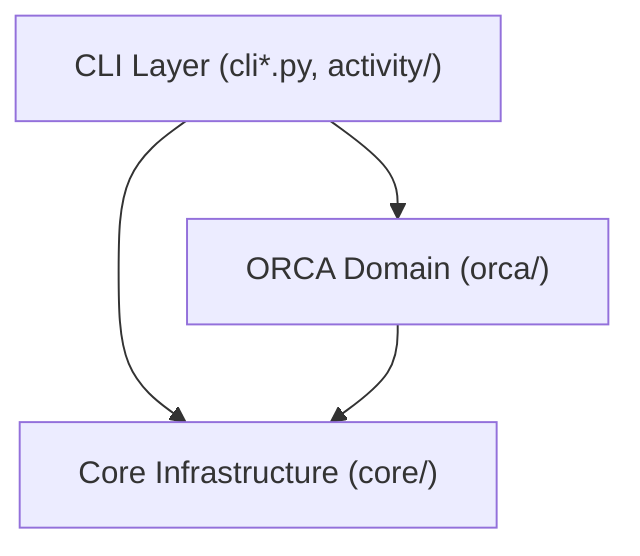

# Architecture and Design Principles

**English** | [한국어](ARCHITECTURE.ko.md)

ORCA_auto is a queue runner and execution supervisor for standalone ORCA quantum chemistry calculations on Linux and WSL.

---

## 1. Core Principles

> Follow one action and consistently explain its source, who owns each change, and its result.

Use the following ownership map when changing ORCA_auto. Keep the job ID and run/generation identity connected across the action, including failure, cancellation and resume.

| Action | Source | Mutation owner | Result |
| :--- | :--- | :--- | :--- |
| Submit | Selected `.inp`, referenced files and resource directives | `submission.py` and input snapshot binding | Generation-bound inputs and a durable queue entry |
| Admit | Queue entry and admission records | Parent queue worker through the admission store | Reserved slot and a child bound to that job |
| Execute | Bound generation inputs and ORCA executable | Worker child through the attempt engine | Output files and recorded attempt evidence |
| Publish | Attempt evidence and terminal decision | Attempt reporting on normal exit; parent terminal replay on interruption/recovery | Terminal state and generation reports, including `machine.json` |
| Notify completion | Matching terminal root `job_state.json` and final result | Parent queue worker claims once through the state writer under the run lock; sender only delivers the captured message | Root notification bookkeeping; generation execution state and reports remain unchanged |
| Query | Queue/state files and job location records | Index publisher updates derived query data | CLI rows and activity views |

A review should identify the original evidence, each state writer and the observable result for the changed action. Completion delivery has one owner, and admission withholds individual rows awaiting publication repair. Submission provenance now follows the execution into its result artifacts. Terminal preparation, capacity release and repairable publication follow the ownership order below.

1. **Durable Queueing**: Submissions are committed atomically to disk. Calculation state is preserved across terminal disconnects and host reboots.
2. **Generation Isolation**: Resubmitting within a job directory creates a fresh, isolated generation directory instead of overwriting prior attempts.
3. **Explicit Recovery**: Calculation failures are diagnosed and permanently recorded. ORCA_auto never modifies inputs or automatically retries failed quantum calculations.
4. **Authoritative On-Disk State**: Persistent JSON files (`job_state.json`, `queue.json`) on disk serve as the source of truth. The SQLite activity index is a projection that can be rebuilt deterministically from disk at any time.

---

## 2. Layering and Boundaries

Dependencies flow strictly in one direction: **`CLI / UI` → `orca` (domain) → `core` (infrastructure)**. The domain and core layers never import CLI code.

| Component | Responsibility |
| :--- | :--- |
| **`cli*.py`, `activity/`, `terminal.py`** | Command parsing, terminal formatting and ANSI styling, activity record models, queue/service status queries, and job cancellation interfaces |
| **`orca/`** | ORCA-specific domain logic: input parsing, resource extraction, execution setup, queue worker and runner execution, output log analysis, convergence verification, and result reporting (`machine.json`) |
| **`core/`** | Shared infrastructure: disk queue store, concurrency admission slots, process supervision and PID management, confined file I/O, configuration loader, index store, and filesystem locks |

> **Architecture Note**: ORCA is the only engine. Workflows, conformer scaffolds, and the xTB/CREST engines (`flow/`) were retired in 7.0.

---

## 3. Submission & Execution Lifecycle

### 1. Submission
- `orca_auto run-dir <PATH>` reads the newest eligible `.inp` and resource directives (`%pal`, `%maxcore`).
- `orca/submission.py` constructs input snapshots, persists the queue entry atomically, and returns immediately.

The submission snapshot records the original paths, SHA-256 hashes and byte counts in `source_inputs`. Submission owns resource normalization and generation-local reference rewriting; `resource_request` records the resolved resources, while `bound_selected_identity` identifies the actual `.inp` given to ORCA. Referenced files retain the same role keys across `source_inputs` and `materialized_inputs`. These are submission-time identities: `runtime_mutable_input_roles` identifies copies the engine may overwrite, and `recovery` preserves the previous generation and seed identities when recovering a crash. Execution carries detached copies of this evidence in `job_state.json`'s `engine_payload.execution_provenance`; it never reconstructs the original identity from later source files.

Normal submission and publication repair both call `queue/job_records.py` with the durable row. Selected-input identity and resources come from captured metadata, with snapshot resources and then configuration defaults used when older rows lack a request. Empty actual resources use that request. Missing captured job labels remain `other`/`unknown`. Neither path rereads the mutable input to rebuild a queued location record.

### 2. Dequeue & Admission
- The background resident worker polls the queue for pending jobs.
- Publication repair derives each queued location record from its durable queue row. A busy publisher or failed index write withholds that row while other eligible rows can use available slots. The worker keeps per-row refusals for the current admission pass even when a lease says `complete` but path validation or persisting its safety fence fails. It inspects and repairs again on the next pass; an unreadable queue stops admission because the source cannot be verified.
- When an eligible job is found, the worker checks the available execution slots (`scheduler.max_active_simulations`), claims one and launches the calculation child.
- When RAM Scratch is enabled, the child reserves its scratch workspace before it writes any run state; the reservation checks host memory and tmpfs capacity ([ADR 0004](adr/0004-concurrent-ram-scratch-under-a-summed-memory-guard.md)). If capacity is temporarily short, the job returns to `pending` without failing, and `queue list` shows it as waiting for resources. Otherwise the calculation runs in an isolated generation workspace.

### 3. Supervision & Clean Exit
- The worker tracks child process status and guarantees clean shutdown upon external signals (`SIGTERM`).
- Interrupted or failed executions retain their specific failure causes in both the queue entry and generation state.

### 4. Convergence & Publication
- Upon calculation exit, `orca/out_analyzer.py` verifies termination banners and scans output lines for error or convergence failures (ignoring comments and input echoes).
- A verified observation payload (`machine.json` adhering to the v1 envelope contract) and human-readable HTML/SI reports are published.

A result with captured source evidence publishes `execution_provenance.json` before `machine.json`. The report publisher copies the generation's recorded evidence; the machine result references it as the `execution-provenance` artifact alongside `input` and `orca-output`. Readers verify both the artifact receipt and agreement with the generation state. A terminal report and its provenance are immutable; terminal replay preserves existing evidence, including historical reports without a provenance artifact.

### Terminal publication and queue completion

The child publishes execution state and generation reports. After the child exits, the parent confirms engine recovery, durably marks the queue generation for replay, prepares missing failure/cancellation evidence, and corrects the queue outcome and run identity from that evidence. A zero exit code also requires a matching terminal run state; it cannot substitute for the recorded result.

The parent then transfers the prepared work item to replay bookkeeping and returns its execution slot. Index publication, the one-shot notification claim and verified replay-marker removal follow through one shared finish function for live completion and restart recovery. An index or marker-clear failure retains the replay and fences the next submission in that directory, while unrelated ready jobs can use the returned capacity. The durable queue marker lets a fresh worker resume; this does not rerun the calculation. Engine recovery, state preparation or slot-release failures retain the supervised job for retry. Publication retry remains periodic, and notification delivery remains best effort.

A terminal replay marker also appears in the activity projection: the terminal execution status is preserved, while detail says `result publication pending`. `publication_blocked_scope=orca_terminal_publication`, the reason, next action and `publication_owner=orca_queue_worker` explain the unfinished publication. These per-directory blockers remain in `admission_blockers` even when the row is filtered off the page. Invalid markers require inspection rather than promising automatic recovery; clearing a valid marker removes the indication.

### State ownership

| File | Source and purpose | Mutation owner |
| :--- | :--- | :--- |
| Job-root `job_state.json` | Current job/run identity and execution state, plus notification bookkeeping used by the parent | `orca/state.py`, called by child execution or parent recovery/notification handling |
| Generation `job_state.json` | Execution evidence for that generation, consumed when verifying its result | The same state writer, after generation ownership validation and only when execution facts change |

The state writer saves changed generation evidence first, then refreshes the current root under one root mutation lock. Notification claim/sent markers are root bookkeeping and are omitted from newly written generation state. An identical execution keeps its generation bytes and `updated_at`; the root timestamp may advance. Repeated terminal reconciliation therefore does not rewrite execution history. Existing historical notification fields remain readable and are left in place when execution facts are unchanged.

These two file replacements are ordered, not one atomic transaction. A generation write failure leaves root unchanged; a root write failure preserves the generation already saved and reports the error. Retrying the same execution refreshes root without rewriting the generation. An unreadable existing state in the verified generation is refused before either state file is replaced. `queue list clear` removes eligible root state while retaining generation artifacts.

### Worker ownership and child execution
The worker separates supervision from execution.

`OrcaQueueWorker` (`orca/queue/worker.py`) is the only queue worker. It owns the
PID-file and singleton-lock lifecycle, admission (a slot is reserved before the
row is claimed by id, with the previewed row as `expected_entry`), child start
and attach, terminal finalization, cancellation, shutdown and orphan
reconciliation. Its base `core.queue.worker.QueueWorkerLoop` orders the passes
(reap, cancel, admit, sleep), runs the shutdown sweep and the signal handlers,
and knows a job only as a process-backed record. Tests substitute
`_start_background_process` and `sleep_fn`; there is no injected dependency
bag. The parent entry point is `python -m orca_auto.orca.commands.queue
--config …`; the child is `python -m orca_auto.orca.commands.worker_child
--config … --queue-root … --queue-id … [--admission-token …]`.

Cancellation observations reuse unchanged queue snapshots. The child publishes its terminal state and reports before exiting. The parent settles the queue entry and claims a completion notification from the matching job/run state. A bounded background sender delivers that captured message without holding the execution slot or writing state afterward. Replayed completion skips an already claimed notification (and recognizes historical sent markers). Delivery is best effort: a crash, a failed send or exhausted sender capacity after the claim can lose the message, without retrying or changing the calculation result. Submission records `orca_queued_notification_pending` on the durable row. After its location record is published, the parent worker claims that intent under the queue lock before dispatching a queued message; CLI exit does not discard the intent. Historical rows without the intent are not notified retroactively. The child captures its started event after recording the attempt and dispatches it before proceeding with the runner. All three lifecycle sends use the same bounded sender (four concurrent sends per process). Transport failure, saturation or process exit can lose advisory delivery, and no send writes execution state. A queued delivery claim failure skips delivery without withholding admission.

The worker CLI loads config, checks the PID file (`read_worker_pid` in
`orca/queue/orphans.py`), then constructs and runs the ORCA worker directly.
`orca/queue/roots.py` owns root selection, listing and the fenced by-id claim;
rows are never claimed by head-of-queue position.
`queue/replay.py` is only the replay engine (work items, preparation and publication, the
reconcile pipeline and generation owners) and takes its state explicitly, and
`queue/run_state_replay.py` synthesizes terminal `job_state.json` under
`run.lock`. These paths call concrete adapters with the selected entry and task
identity. Durable execution preparation precedes admission release; derived publication
can retry afterward while its marker fences the same directory. RUNNING-row
reconciliation is worker-owned: a submission never sweeps the queue and recovers
only its own directory's dead row when no worker pid is live.

The ORCA child directly resolves its queue entry, recovers a crashed generation,
waits for parent admission handoff, and runs that generation. The parent retains
final admission-release ownership on success, shutdown and exceptions. Validated
inputs, resources and queue identity form one `RunExecutionContext`, which is
passed directly into execution without reconstructing CLI arguments or installing
empty lifecycle callbacks.

---

## 4. Operational Architecture

- **SQLite Activity Projection**: Routine queries are served by a rebuildable SQLite index, avoiding recursive disk scans for routine commands. The projection keys location rows by job id; `job_locations.json` itself is rebuildable from the run states on disk with `index rebuild`, and `--refresh` persists unindexed runs through the same rebuild. The run-status and snapshot-supersession rules the listing applies live in `orca/run_status.py`, not in the CLI layer. `index rebuild` merges disk-derived location rows; it does not rebuild the SQLite activity database.
- **Scratch Operator Surface**: `orca_auto scratch list` and `scratch clear` inspect and remove non-live RAM-scratch workspaces; one stale, unverifiable or invalid-manifest workspace otherwise blocks every later scratch launch (fail-closed).
- **Prepared Wheel Runtimes**: For production servers, ORCA_auto can be deployed as an immutable, offline wheel installation, isolating runtime execution from development checkouts ([docs/RUNTIME.md](RUNTIME.md)).
- **Historical Data Protection**: Retired workflow directories from previous versions are protected as read-only to ensure historical calculations are preserved without risk of accidental overwrite.

---

## 5. Architecture Decision Records (ADR)

When to write an ADR, its rules and its template are in [the ADR guide](adr/README.md).

- [ADR 0001: One public machine.json per generation](adr/0001-one-public-machine-json-per-generation.md)
- [ADR 0002: No automatic retry of failed calculations](adr/0002-no-automatic-retry-of-failed-calculations.md)
- [ADR 0003: Retire workflows for standalone ORCA jobs](adr/0003-retire-workflows-for-standalone-orca-jobs.md)
- [ADR 0004: Concurrent RAM scratch under a summed memory guard](adr/0004-concurrent-ram-scratch-under-a-summed-memory-guard.md)
