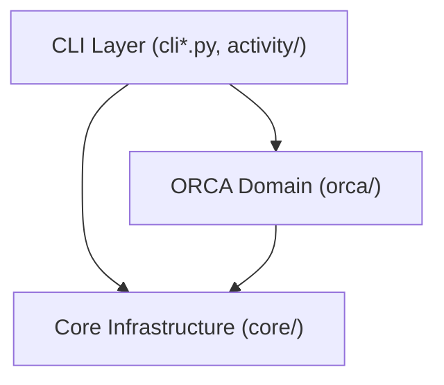

# Architecture and Design Principles

**English** | [한국어](ARCHITECTURE.ko.md)

ORCA_auto is a queue runner and execution supervisor designed for durable execution and observable monitoring of standalone ORCA quantum chemistry calculations on Linux and WSL.

---

## 1. Core Principles

1. **Durable Queueing**: Submissions are committed atomically to disk. Calculation state is preserved across terminal disconnects and host reboots.
2. **Generation Isolation**: Resubmitting within a job directory creates a fresh, isolated generation directory instead of overwriting prior attempts.
3. **Explicit Recovery**: Calculation failures are triaged and permanently recorded. ORCA_auto never modifies inputs or blindly retries failed quantum calculations.
4. **Authoritative Source of Truth**: On-disk persistent JSON files (`job_state.json`, `queue.json`) serve as the source of truth. The SQLite activity index is a projection that can be rebuilt deterministically from disk at any time.

---

## 2. Layering and Boundaries

Dependencies flow strictly in one direction: **`CLI / UI` → `orca` (domain) → `core` (infrastructure)**. The domain and core layers never import CLI code.

| Component | Responsibility |
| :--- | :--- |
| **`cli*.py`, `activity/`** | Command parsing, terminal formatting, queue querying, service status, and job cancellation interfaces |
| **`orca/`** | ORCA input (`.inp`) parsing, resource extraction, execution workspace setup, output log analysis, convergence verification, and result reporting (`machine.json`) |
| **`core/`** | Disk queue store, concurrency admission slots, process supervision, systemd integration, and filesystem locks |

> **ORCA_auto 7.0 Structure**: Workflows, conformer scaffolds, and xTB/CREST engines (`flow/`) were retired in 7.0. The engine catalog contains only standalone `orca`, significantly simplifying the runtime architecture.

---

## 3. Submission & Execution Lifecycle

### 1. Submission
- `orca_auto run-dir <PATH>` reads the newest eligible `.inp` and resource directives (`%pal`, `%maxcore`).
- `orca/submission.py` constructs input snapshots, persists the queue entry atomically, and returns immediately.

### 2. Dequeue & Admission
- The background resident worker polls the queue for pending jobs.
- When an eligible job is found, the worker checks available execution slots (`scheduler.max_active_simulations`) and host memory capacity (when RAM Scratch is enabled).
- If resources are sufficient, the worker claims the slot and launches the calculation in an isolated generation workspace. If memory is temporarily constrained, the job is deferred in `waiting for resources` state without failing.

### 3. Supervision & Clean Exit
- The worker tracks child process status and guarantees clean shutdown upon external signals (`SIGTERM`).
- Interrupted or failed executions retain their specific failure causes in both the queue entry and generation state.

### 4. Convergence & Publication
- Upon calculation exit, `orca/out_analyzer.py` verifies termination banners and convergence against the output lines (ignoring comments and input echoes).
- A verified observation payload (`machine.json` adhering to the v1 envelope contract) and human-readable HTML/SI reports are published.

---

## 4. Operational Architecture

- **SQLite Activity Projection**: High-performance querying is provided by a rebuildable SQLite index, avoiding recursive disk scans for routine commands. The `--refresh` flag scans for unindexed runs.
- **Prepared Wheel Runtimes**: For production servers, ORCA_auto can be deployed as an immutable, offline wheel installation to eliminate risks associated with running directly out of mutable development checkouts ([docs/RUNTIME.md](RUNTIME.md)).
- **Historical Data Protection**: Retired workflow directories from previous versions are protected as read-only to ensure historical calculations are preserved without risk of accidental overwrite.
