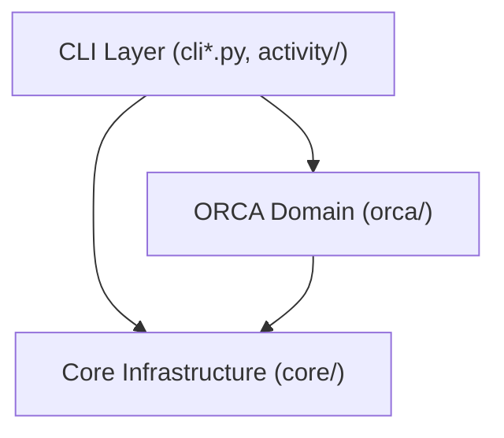

# Architecture and Design Principles

**English** | [한국어](ARCHITECTURE.ko.md)

ORCA_auto is a queue runner and execution supervisor for standalone ORCA quantum chemistry calculations on Linux and WSL.

---

## 1. Core Principles

> Follow one action and explain its source, who changes which state, and where the result lands, also under failure, cancellation and resume.

Section 3 turns this rule into checked artifacts: every durable file with its one writer and its readers, every action as a call path, each invariant with the test that enforces it, and the vocabulary. A change keeps the job ID and the run and generation identity connected across the action; a review names the original evidence, each state writer and the observable result of the changed action.

1. **Durable Queueing**: Submissions are committed atomically to disk. Calculation state is preserved across terminal disconnects and host reboots.
2. **Generation Isolation**: Resubmitting within a job directory creates a fresh, isolated generation directory instead of overwriting prior attempts.
3. **Explicit Recovery**: Calculation failures are diagnosed and permanently recorded. ORCA_auto never modifies inputs or automatically retries failed quantum calculations.
4. **Authoritative On-Disk State**: Persistent JSON files (`job_state.json`, `queue.json`) on disk serve as the source of truth. Queries read them directly; no derived query store is kept.

---

## 2. Layering and Boundaries

Dependencies flow strictly in one direction: **`CLI / UI` → `orca` (domain) → `core` (infrastructure)**. The domain and core layers never import CLI code.

```mermaid
graph TD
    CLI["CLI Layer (cli*.py, activity/)"]
    ORCA["ORCA Domain (orca/)"]
    CORE["Core Infrastructure (core/)"]

    CLI --> ORCA
    CLI --> CORE
    ORCA --> CORE
```

| Component | Responsibility |
| :--- | :--- |
| **`cli.py`, `cli_parsers.py`, `cli_handlers.py`, `cli_run_dir.py`, `cli_queue.py`, `cli_index.py`, `cli_scratch.py`, `cli_workers.py`, `cli_worker_supervision.py`** | Command parsing and one handler module per command family. `cli.main` is the one guard for a closed stdout pipe. `cli_handlers.resolve_command_config` resolves shared command configuration and names what is missing. `cli_run_dir` loads the full ORCA config once and passes that same object through target validation and queue submission; it pins the `run-dir` target through one inode; `cli_workers` refuses a second worker and `cli_worker_supervision` restarts and stops the one worker process |
| **`activity/`, `activity_labels.py`, `activity_rendering.py`, `terminal.py`, `terminal_table.py`** | The queue catalog (`activity/_orca.catalog`), the cancel target rule (`activity/_cancel.target_rows`) and presentation. `activity_labels` builds each queue-table cell, `activity_rendering.queue_list_table` returns everything `queue list` prints as text and `cli_queue` only chooses TTY or plain styling; `terminal.py` holds the one icon and colour per status and `terminal_table.py` the display widths. Status groupings live in `core/statuses.py` |
| **`cli_systemd_*.py`, `systemd_plan.py`, `_process_evidence.py`** | `systemd install`, `service status` and `service restart`, layered bottom-up and enforced by import-linter: the unit plan (`systemd_plan`), unit rendering (`cli_systemd_units`), unit and `/proc` readers (`cli_systemd_evidence`), the freshness judges (`cli_systemd_freshness*`), the idle-only guard over the one admission store (`cli_systemd_restart_guard`), then the command owners (`cli_systemd_apply`, `cli_systemd_restart`, `cli_systemd_status`). `_process_evidence` records the import source a worker started from |
| **`orca/`** | ORCA-specific domain logic: input parsing, resource extraction, execution setup, queue worker and runner execution, output log analysis, convergence verification, and result reporting (`machine.json`) |
| **`core/`** | Shared infrastructure: disk queue store, admission slots, process supervision and the PID file, confined file I/O, configuration discovery and loading, location index store, RAM scratch workspaces, notification channels and filesystem locks |
| **`machine_contracts/`** | Source-owned `factory/machine-observation` v1 validator for the ORCA_auto routes, with the envelope and `chemistry/results-bundle` schemas packaged in the wheel; it needs no external clone, and `jsonschema` comes from the optional `validation` extra. `orca/machine_observation` builds every `machine.json`; this package only verifies one, writes nothing, and is never imported by `core/` or `orca/` ([ADR 0014](adr/0014-source-owned-machine-observation-validator.md)) |

The `[tool.importlinter]` contracts in `pyproject.toml` enforce these directions and the systemd layering; `make check` runs them through `scripts/check_imports.py`.

> **Architecture Note**: ORCA is the only engine, and each job is one standalone ORCA input directory. There is no workflow layer ([ADR 0005](adr/0005-remove-retired-workflow-support.md)).

Queue rows cross the disk boundary through `core/queue/persistence.entry_from_dict`, which validates the schema and normalizes identifiers, status and priority. Internal readers use the typed `QueueEntry` fields directly. `orca/queue/entries` owns generation identity and interpretation of untyped metadata; its metadata-copy helper preserves callers' detached updates. `effective_queue_status` adds only the display policy for a pending cancellation. Persisted ORCA labels remain constants in `orca/app_ids.py`; there is no engine catalog.

---

## 3. Ownership Map

Every durable file has one writer module. `tests/core/queue/test_ownership_guards.py` walks the package source and fails when a writer is reached from outside the owners listed below; a change of owner updates that guard and this section together. Paths use `<runs_root>` (the queue root), `<reaction_dir>` (a job directory) and `<generation_dir>` (one generation directory inside it). "CLI" is a command process, "parent" the worker parent and "child" the worker child.

### Durable files and writers

| File | Lock | Writer | Called from | Readers |
| :--- | :--- | :--- | :--- | :--- |
| `<runs_root>/queue.json` | `<runs_root>/queue.lock` | `core/queue/store.mutate_entries` (→ `persistence.save_entries`); PENDING and terminal rows built only by `transitions.requeued_entry` and `terminal_entry`, new rows only by `adapter.enqueue` | CLI: `adapter.enqueue`, `enqueue_publication`, `adapter.cancel`, `store.clear_terminal`. Parent: claim (`store.dequeue_entry_if_pending`), `publication_repair`, the queued-notification claim, `settlement` marks and binding, `orphans`. Child: `adapter.requeue_running_entry`, `adapter.mark_failed`, `recovery_rebind` | `store.list_queue` (catalog, worker preview, adapters), `store.QueueCancellationProbe`; `run_cleanup` and the intent sweep read it under the lock without writing |
| Root `<reaction_dir>/job_state.json` | `.job_state.mutation.lock`, inside `run.lock` | `orca/state.save_state`; `finalize_state` for a terminal result | Child: `execution.execute_locked_run`, `attempt/run`, `attempt/resume`, `output_adoption`, `attempt/reporting.exit_with_result`. Parent: `terminal_state._record_terminal_run_state`, `notifications.claim_and_send_terminal`. CLI: `run_cleanup.clear_terminal_run_states` unlinks it (`queue list clear`) | `state_reading.load_state`, `run_snapshot.load_pinned_state` (catalog), `terminal_marker` fingerprints |
| Generation `<generation_dir>/job_state.json` | the same | `state.save_state` → `state.write_generation_bytes`, only for a verified generation and only when execution facts change | the same as the root state | `state_reading.load_generation_state` |
| `<runs_root>/.admission/admission_slots.json` | `.admission/admission.lock` | `core/admission/store.py` (`AdmissionStore`, → `persistence.save_slots`) | Parent: `reserve_slot`, `update_slot_metadata`, `release_slot`, `recover_slot_engine_process`, `recover_orphaned_engine_slots`, `reconcile_stale_slots`. Child: `execution._child_admission_slot` (activate, complete, release a dead slot), the runner through `engine_process`'s preparer and registrar | `read_active_slot_count` (capacity, `queue list`, restart guard), `get_slot` (child hand-off), `list_all_slots` |
| `<runs_root>/job_locations.json` | `<runs_root>/job_locations.lock` | `core/indexing/store.py` (`_save_records`) | CLI: `queue/job_records.upsert_row_job_record` (queued), `index rebuild` (`merge_job_locations`), `index prune`. Parent: `upsert_row_job_record` (repaired and running rows), `settlement._publish` (`upsert_terminal_job_record`) | `run_snapshot` (the `queue list clear` scan), `job_locations.upsert_job_record` |
| `<runs_root>/.orca_auto_snapshot_intents/<token>.json` | `.orca_auto_snapshot_intents.mutation.lock` | `core/queue/snapshot_intent.py` | CLI: `execution_binding` build (create, bind), `submission` (enqueueing, then owned and retired). Parent: `retire_snapshot_intent_for_row` before a start (an intent the submission left), `reconcile_orphaned_snapshot_generations` in recovery. Child: `recovery_rebind` for a replacement generation | `snapshot_intent.py` itself |
| Generation owner xattr `user.orca_auto.generation_owner` | the intent mutation lock | `core/queue/generation_owner.bind_direct_generation_owner` | `snapshot_intent.bind_snapshot_intent_generation_identities` | `generation_owner.require_direct_generation_owner` (through `state_reading.verified_generation_artifact_target`) |
| Replay marker `orca_terminal_replay` in a row's metadata | `queue.lock` (it lives in `queue.json`) | format: `orca/queue/terminal_marker.py`; set in the same mutation as the terminal mark, cleared only by `settlement.clear_marker` | Parent: `adapter.mark_completed`, `mark_failed`, `mark_cancelled`, `orphans.apply_terminal_reconciliation`, `settlement.retire_marker`. Child: `adapter.requeue_running_entry` on a cancel, `adapter.mark_failed` for a rejected claim. CLI: `adapter.cancel` of a pending row | `settlement.work_item_for_row`, `replay`, the catalog (`result publication pending`) |
| `<generation_dir>/machine.json`, `execution_provenance.json` | `run.lock` | `report/publication.write_report_json` (→ `state.write_generation_bytes`); every `machine.json` field from `machine_observation.build_machine_observation` | `publication.write_report_files`, from the child's `attempt/reporting.exit_with_result` and the parent's `terminal_state._record_terminal_run_state` | external readers; `publication` checks terminal immutability |
| `<generation_dir>/job_report.html`, `si_block.md` | `run.lock` | `report/publication.write_job_html_report`, `report/si.write_si_block` | `publication.write_report_files` (the same two callers) | external readers |
| `<reaction_dir>/run.lock` | the lock itself | `orca/run_lock.acquire_run_lock` | Child: `execution.execute_locked_run`, `recovery_rebind`. Parent: `terminal_state._record_terminal_run_state`, `notifications.claim_and_send_terminal` | shared probes through `process_tracking.run_lock_status`: `run_status.observed_queue_status`, `orphans`, `run_cleanup`, `submission` |
| `<runs_root>/queue_worker.pid` | `queue_worker.pid.lock`, held for the worker's lifetime | `core/queue/worker/pid_file.py` | Parent: `OrcaQueueWorker._write_pid_file` and `_remove_pid_file` under the lifetime lock. PID readers never mutate the file ([ADR 0011](adr/0011-read-only-pid-lookups.md)) | `orca/commands/queue.existing_worker_pid`, `submission`, `orphans` |
| RAM scratch manifest `<scratch_root>/attempt-*/.orca_auto_scratch.json` | `<scratch_root>/.orca_auto_scratch.lock` | `core/engine_scratch/_manifest._write_workspace_manifest` | Child: `EngineScratchWorkspace.create` (`OrcaRunner.prepare`). CLI: `scratch clear` removes non-live workspaces | `engine_scratch/_inspect` (launch sweep, `scratch list`) |
| Scratch copy-back into `<generation_dir>` and its `.orca_auto_scratch_publication.json` journal | `run.lock` | `core/engine_scratch/_publication._publish_workspace` | Child: `OrcaRunner` through `EngineScratchWorkspace.publish` | `_recover_incomplete_publication` on the next launch |
| `<runs_root>/logs/<queue_id>.log` | none | `core/queue/processes.start_background_process` (the child's stdout and stderr) | Parent: `OrcaQueueWorker._start_background_process`. CLI: `queue list clear` removes it | `queue list` shows the path |
| `orca_auto.yaml` | none | `orca/commands/init._write_config` | CLI: `init` | `core/config/files` loaders through `orca/config.load_config` |
| systemd unit files | none | `cli_systemd_apply._write_unit_files` | CLI: `systemd install` | systemd; `service status` compares them with the running worker |

### Action call paths

Each path lists the named steps from the entry point to the last durable write. `→` leads to the next step, which the previous one calls or which runs after it; parentheses name the calls a step makes itself.

| Action | Process | Call path | Durable result |
| :--- | :--- | :--- | :--- |
| Submit | CLI | `cli_run_dir.cmd_run_dir` → `commands/run_inp.cmd_run_inp` → `submission.submit_reaction_dir_to_queue` → `submission.create_queued_submission` (`execution_binding.build_orca_execution_snapshot`) → `enqueue_publication.run_enqueue_publication` (`adapter.enqueue`) → `job_records.upsert_row_job_record` → `snapshot_intent.mark_snapshot_intent_owned` | generation directory with bound inputs and owner xattr, `queue.json` row with a publication lease, queued `job_locations.json` record; the snapshot intent is retired once the row is committed. A failed publication parks the row as repair pending for the worker |
| Admit | parent | `QueueWorkerLoop._fill_slots` → `OrcaQueueWorker._admit_next` (`repair_queue_publications`, `notify_queued_jobs`, `admission_has_capacity`, `roots.peek_next_entry`, `_try_reserve_admission_slot`, `roots.dequeue_next_entry`) → `_start_reserved` (`retire_snapshot_intent_for_row`) → `_start_job` (`_start_background_process`) → `_on_worker_process_started` (`update_slot_metadata`, `upsert_row_job_record`) | slot `reserved` then `active` with the child's pid, row RUNNING, intent retired, running location record. A lost claim releases the slot |
| Execute | child | `commands/worker_child.main` → `worker_execution.run_worker_child_job` (`maybe_rebind_recovery_generation`, `await_parent_admission_handoff`) → `process_dequeued_entry` → `execution.execute_orca_run` → `execute_locked_run` (`run.lock`, `recover_crashed_state`, `_child_admission_slot`) → `attempt/run.run_attempt` (`OrcaRunner.run`, `out_analyzer.analyze_output`) → `attempt/reporting.exit_with_result` (`write_report_files`) | root and generation `job_state.json`, ORCA output, reports; slot activated and completed. A scratch capacity refusal returns the row to `pending`; a stop requeues it, or marks it cancelled with a replay marker when a cancel was requested |
| Settle | parent | `QueueWorkerLoop._check_completed_jobs` → `OrcaQueueWorker._finalize_completed_job` (`recover_slot_engine_process`, `settlement.mark_terminal_row`) → `_hand_off_terminal_row` (`settlement.work_item_for_row`) → `_settle_live` (`settlement.is_superseded`) → `settlement.prepare` (`terminal_state.record_failed_run_state`, `record_cancelled_run_state`) → `settlement.bind_row` → `_release_terminal_job` (`release_slot`) → `settlement.finish` (`_publish`, `retire_marker`) | terminal row with its marker, missing failed or cancelled `job_state.json` and reports, slot removed, terminal location record, notification claim, marker cleared. A failed step keeps the job or its replay for retry |
| Recover | parent | `OrcaQueueWorker._reconcile_worker_state` → `snapshot_intent.reconcile_orphaned_snapshot_generations` → `_release_unattached_admission_slots` → `recover_orphaned_engine_slots`, `reconcile_stale_slots` → `orphans.reconcile_orphaned_running_entries` → `replay.reconcile_terminal_replays` (`settlement.settle`) | abandoned intents and generations removed, stray slots released, orphaned RUNNING rows requeued or marked terminal, marked rows settled as above |
| Notify | parent, child | queued: `_periodic_upkeep` or `_admit_next` → `notifications.notify_queued_jobs` (`_claim_queued_notifications`) → `orca/notifications.dispatch_notification`. Started: `attempt/run.run_attempt` → `dispatch_notification`. Finished: `settlement._publish` → `notifications.claim_and_send_terminal` → `dispatch_notification` | `orca_queued_notification_pending` cleared in `queue.json`; `finished_notification_claimed_at` in the root `job_state.json`; nothing for the started event. Delivery writes nothing |
| Cancel request | CLI | `cli_queue.cmd_queue_cancel` → `activity/_cancel.cancel_activity` (`_orca.catalog`, `target_rows`) → `adapter.cancel` → `transitions.request_cancel` | a pending row becomes cancelled with a replay marker, settled by the next recovery pass; a running row gets `cancel_requested` |
| Cancel stop | parent, child | Parent: `OrcaQueueWorker._check_cancel_requests` (`cancel_requested_ids`) → `_cancel_running_job` (`_stop_child_and_recover_engine`, then `adapter.mark_cancelled` unless the child marked the row) → `_hand_off_terminal_row` → `_settle_live`. Child: `OrcaRunner.run` raises `WorkerShutdownInterrupt` → `run_worker_child_job` (`adapter.requeue_running_entry`) | the child's attempt and scratch evidence; row cancelled with a marker by the child or the parent; the cancelled `job_state.json` result written only by the parent's settlement ([ADR 0008](adr/0008-parent-writes-the-cancelled-result.md)) |
| Query | CLI | `cli_queue.cmd_queue_list` → `activity/_list.list_activities` → `activity/_orca.catalog` (`adapter.list_queue`, `run_snapshot.collect_run_snapshots`) → `run_status.observed_queue_status` → `activity_rendering.queue_list_table` | nothing written; reads `queue.json`, each row's root `job_state.json`, a `run.lock` probe and the slot count |
| Index rebuild | CLI | `cli_index.cmd_index_rebuild` → `job_locations/_rebuild.rebuild_job_location_records` → `core/indexing/store.merge_job_locations` (`_save_records`); `index prune`: `cli_index.cmd_index_prune` → `prune_job_locations` | `job_locations.json` rows added or updated from the run states on disk, never removed by a rebuild |
| Clear | CLI | `cli_queue.cmd_queue_list` (`clear`) → `activity/_clear.clear_activities` → `run_cleanup.clear_terminal_records` → `clear_terminal_run_states` → `clear_terminal_queue_entries` (`store.clear_terminal`) | unprotected root `job_state.json` files unlinked, terminal rows without a marker removed with their worker logs and publication locks; generation artifacts kept |

### Invariant index

| Invariant | Owner | Enforced by |
| :--- | :--- | :--- |
| `queue.json` has one writer; its lock is held elsewhere only to read | `core/queue/store.mutate_entries` | `tests/core/queue/test_ownership_guards.py` (`test_queue_file_is_written_only_by_the_store`, `test_queue_lock_is_held_outside_the_store_only_by_read_only_users`) |
| PENDING and terminal rows come from two constructors; a row is created once and `enqueued_at` is never rewritten | `transitions.requeued_entry`, `terminal_entry`, `adapter.enqueue` | `test_ownership_guards.py` (`test_pending_and_terminal_rows_are_built_only_by_the_transition_constructors`, `test_rows_are_created_once_and_no_rewrite_sets_enqueued_at`) |
| One generation identity decides the token and every writer fence ([ADR 0006](adr/0006-one-generation-identity-for-token-and-fences.md)) | `orca/queue/entries.generation_identity` | `tests/contracts/test_rule_pins_queue.py`, `tests/orca/queue/test_entries.py` |
| Each atomic-write primitive is called only by the module that owns the file it writes | the table above | `test_ownership_guards.py::test_atomic_writers_are_called_only_by_the_module_that_owns_the_file` |
| `job_state.json` is saved only through the state writer, generation evidence before root | `orca/state.save_state` | `test_ownership_guards.py::test_job_state_is_written_only_through_the_state_writer_by_its_owners`, `tests/orca/test_state.py` |
| Only the parent's settlement records a cancelled result ([ADR 0008](adr/0008-parent-writes-the-cancelled-result.md)) | `terminal_state.record_cancelled_run_state` | `test_ownership_guards.py::test_only_the_parent_settlement_records_a_cancelled_result`, `tests/orca/queue/test_settlement_faults.py`, `tests/orca/test_worker_execution.py::test_cancelled_child_leaves_the_cancelled_result_to_the_parent` |
| `machine.json` and the reports are built and written by the publisher; a terminal report is immutable | `report/publication.write_report_files`, `machine_observation.build_machine_observation` | `test_ownership_guards.py::test_machine_json_and_reports_are_written_only_by_the_publisher`, `tests/orca/test_state.py::test_terminal_machine_observation_is_immutable`, `tests/contracts/test_report_outputs.py` |
| One admission store under `runs_root`, limited by `scheduler.max_active_simulations` ([ADR 0007](adr/0007-one-admission-store-under-runs-root.md)) | `core.admission.admission_dir` | `tests/contracts/test_rule_pins_admission.py::test_admission_resolution`, `tests/orca/queue/test_worker_start.py::test_worker_roots_and_limit_match_the_rendered_unit` |
| Slots are written only by the store, each mutation only from its owner; the child follows one slot rule | `core/admission/store.py`, `execution._child_admission_slot` | `test_ownership_guards.py` (`test_admission_slots_are_written_only_by_the_store_for_their_owners`, `test_only_the_worker_reconcile_lists_slots_with_a_rewrite`), `tests/contracts/test_rule_pins_admission.py::test_child_slot_outcome` |
| A slot is reserved before the row is claimed and released when the claim fails | `OrcaQueueWorker._admit_next` | `tests/orca/queue/test_worker_admission.py` (`test_admission_pass_reserves_the_slot_before_it_claims_the_row`, `test_admission_pass_releases_the_slot_when_the_claim_fails`) |
| A generation runs ORCA at most once; a run resumes only by rebinding ([ADR 0009](adr/0009-resume-only-by-rebind.md)) | `recovery_rebind.maybe_rebind_recovery_generation`, `attempt/run.run_attempt` | `tests/orca/test_recovery_rebind.py::test_rebind_moves_crashed_claim_into_new_generation`, `tests/orca/attempt/test_single_attempt_contract.py` |
| Settlement writes in one order live and on replay, and a failed step is retried | `orca/queue/settlement.py` | `tests/orca/queue/test_settlement_faults.py::test_settlement_fault_matrix`, `tests/contracts/test_rule_pins_replay_retry.py`, the `effects.json` goldens of `tests/contracts/test_durable_files.py` |
| One fail-closed verdict decides whether a terminal generation still owns its directory | `terminal_marker.terminal_generation_verdict` | `tests/contracts/test_rule_pins_replay.py::test_replay_supersession_truth_table` |
| `job_locations.json` is written only through the job-record projection and the `index` commands | `core/indexing/store.py`, `queue/job_records.py` | `test_ownership_guards.py::test_location_index_is_written_only_through_job_records_and_index_commands` |
| Queue commands read queue rows and each row's own state, nothing else ([ADR 0010](adr/0010-queue-commands-read-queue-rows.md)) | `activity/_orca.catalog` | `tests/activity/test_orca_discovery.py::test_listing_reads_neither_the_location_index_nor_the_run_tree`, `tests/activity/test_orca.py::test_catalog_joins_queue_rows_with_their_own_state_only` |
| Notifications are dispatched from three sites and claimed at most once | `orca/queue/notifications.py`, `attempt/run.run_attempt` | `test_ownership_guards.py::test_notifications_are_dispatched_only_from_the_three_claim_sites`, `tests/orca/queue/test_notifications.py` |
| The worker writes its own PID file | `OrcaQueueWorker._write_pid_file` | `test_ownership_guards.py::test_worker_pid_file_is_written_only_by_the_worker`, `tests/core/queue/test_worker.py::test_worker_pid_file_handles_live_stale_dead_missing_and_invalid_pids` |
| A failed poll pass never stops supervision of running children | `QueueWorkerLoop.run` | `tests/core/queue/test_worker.py::test_queue_worker_loop_keeps_supervising_after_a_failed_poll_pass` |
| One rule classifies an input's route for completion, reports and the SI block | `completion_rules.route_facts` | `tests/orca/test_completion_rules.py::test_route_facts_classify_every_route_line_and_the_scan_block`, `tests/contracts/test_rule_pins_analysis.py` |
| Domain and core never import the CLI layer; the systemd modules stay layered | `pyproject.toml` `[tool.importlinter]` | `scripts/check_imports.py` in `make check`, `tests/tooling/test_cli_layer_contract.py` |
| Public durable files, CLI documents and report bytes change only on purpose | `tests/contracts/golden/` | `tests/contracts/test_durable_files.py`, `test_cli_documents.py`, `test_report_outputs.py` |

### Glossary

| Term | Meaning | In code |
| :--- | :--- | :--- |
| runs root, allowed root, queue root | One directory: it holds `queue.json`, `job_locations.json`, `.admission/`, `logs/`, the snapshot intents and the PID file, and every job directory lies under it | config key `runs_root`; `cfg.runtime.allowed_root`; `orca/queue/roots.queue_root(cfg)` |
| reaction directory, job directory | The directory a user submits. `reaction_dir` is the persisted key that queue rows match on and the field `queue list --json` prints; `job_state.json` records the same path as `job.dir`, and `run-dir` prints it as `job_dir` | row metadata `reaction_dir`; `RunExecutionContext.reaction_dir` |
| generation (queue row) | One submission of a job: the row's identity without its lifecycle metadata; `job_state.json` records its digest | `entries.generation_identity`, `queue_entry_generation_token`, state `queue_generation` |
| generation directory | `<reaction_dir>/<YYYYMMDD-HHMMSS-8hex>`: the bound inputs, outputs and reports of one execution | `core/queue/generation.new_visible_generation_name`, snapshot `execution_dir` |
| directory owner | The owner xattr binding a generation directory to its intent; in replay, the one generation per directory whose terminal row is settled | `generation_owner.py`; `replay._select_generation_owner` |
| execution snapshot | The row's record of bound inputs, identities, resources and the executable, verified at claim time | row metadata `execution_snapshot`, `execution_binding` |
| snapshot intent | A pre-enqueue ledger entry (creating, enqueueing, owned) that lets recovery remove a generation no row owns | `core/queue/snapshot_intent.py` |
| run snapshot | A pinned read of a job directory's root state for listing and cleanup | `run_snapshot.collect_run_snapshots` |
| admission slot, admission token | One row of `admission_slots.json` (`state`, `engine_process_state`); its token is passed to the child as `--admission-token` | `AdmissionSlot`, `reserve_slot`, `RunExecutionContext.admission_token` |
| replay marker | Row metadata written with the terminal mark: the work the parent still owes (state, reports, index, notification). It fences the next submission in the directory until cleared | `orca_terminal_replay`, `terminal_marker.py`; fence without side effects: `orca_terminal_replay_fence_only` |
| settlement | The parent's steps from a terminal-marked row to published results: mark, prepare, bind, release slot, finish; live or on restart replay | `orca/queue/settlement.py`, `OrcaQueueWorker._settle_live`, `replay.reconcile_terminal_replays` |
| supersession | A terminal generation whose directory state now belongs to a newer run; its marker is retired without writes | `terminal_generation_verdict`, `settlement.is_superseded` |
| queued-record publication | Publishing a new row's queued location record under its lease; repaired by the worker when it fails | `enqueue_publication.py`, `publication_repair.py` |
| terminal publication | Index record, notification claim and marker retirement after settlement; shown as `result publication pending` | `settlement.finish`, scope `orca_terminal_publication` |
| scratch copy-back | Moving RAM scratch outputs into the generation directory under a journal | `engine_scratch/_publication.py` |
| location index | `job_locations.json`: where each job ran, rebuildable from disk; `queue list` does not read it. The former SQLite activity projection is removed | `core/indexing`, `orca/job_locations`, `index rebuild` |
| rebind | Moving a claim whose generation shows started execution into a fresh generation before it runs | `recovery_rebind.maybe_rebind_recovery_generation` |

---

## 4. Submission & Execution Lifecycle

### 1. Submission
- `orca_auto run-dir <PATH>` reads the newest eligible `.inp` and resource directives (`%pal`, `%maxcore`).
- `orca/submission.py` constructs input snapshots, persists the queue entry atomically, and returns immediately.

The submission snapshot records the original paths, SHA-256 hashes and byte counts in `source_inputs`. Submission reads the selected `.inp` once: the queue row's job type, molecule key, geometry path and resource request, the `source_inputs` digest and the bound copy all describe those bytes, even when the file is saved again while the submission runs. Submission owns resource normalization and generation-local reference rewriting; `resource_request` records the resolved resources, while `bound_selected_identity` identifies the actual `.inp` given to ORCA. Referenced files retain the same role keys across `source_inputs` and `materialized_inputs`. These are submission-time identities: `runtime_mutable_input_roles` identifies copies the engine may overwrite, and `recovery` preserves the previous generation and seed identities when recovering a crash. Execution carries detached copies of this evidence in `job_state.json`'s `engine_payload.execution_provenance`; it never reconstructs the original identity from later source files. Build, claim-time verification, crash recovery and cleanup read a snapshot through one rule set in `orca/execution_binding/_snapshot_identity.py`: the version gate, the dependency role names, the content descriptors, the resource request and the directory identity. The four paths therefore accept and refuse the same snapshots.

Normal submission and publication repair both call `queue/job_records.py` with the durable row, and the worker records a claimed row as running through the same projection (`upsert_row_job_record`); the module also projects the terminal record from the generation's terminal state. Selected-input identity and resources come from captured metadata, with snapshot resources and then configuration defaults used when older rows lack a request. Empty actual resources use that request. Missing captured job labels remain `other`/`unknown`. Neither path rereads the mutable input to rebuild a queued location record.

### 2. Dequeue & Admission
- The background resident worker polls the queue for pending jobs.
- Publication repair derives each queued location record from its durable queue row. A busy publisher or failed index write withholds that row while other eligible rows can use available slots. The worker keeps per-row refusals for the current admission pass even when a lease says `complete` but path validation or persisting its safety fence fails. It inspects and repairs again on the next pass; an unreadable queue stops admission because the source cannot be verified.
- When an eligible job is found, the worker checks the available execution slots (`scheduler.max_active_simulations`) in the one admission store, `<runs_root>/.admission` ([ADR 0007](adr/0007-one-admission-store-under-runs-root.md)), claims one and launches the calculation child.
- When RAM Scratch is enabled, the child reserves its scratch workspace before it writes any run state; the reservation checks host memory and tmpfs capacity ([ADR 0004](adr/0004-concurrent-ram-scratch-under-a-summed-memory-guard.md)). If capacity is temporarily short, the job returns to `pending` without failing, and `queue list` shows it as waiting for resources. Otherwise the calculation runs in an isolated generation workspace.

### 3. Supervision & Clean Exit
- The worker tracks child process status and guarantees clean shutdown upon external signals (`SIGTERM`).
- An execution interrupted by a worker shutdown or a lost worker returns its row to `pending`, and the next claim rebinds it into a fresh generation before it runs unless its completed output settles it ([ADR 0009](adr/0009-resume-only-by-rebind.md)). Failed executions retain their specific failure causes in both the queue entry and generation state.

### 4. Convergence & Publication
- Upon calculation exit, `orca/out_analyzer.py` streams the output once: it verifies termination banners and scans the lines for error or convergence failures (ignoring comments and input echoes), and for a TS route counts the imaginary modes of the final frequency section in the same pass.
- A verified observation payload (`machine.json` adhering to the v1 envelope contract) and human-readable HTML/SI reports are published. `orca/machine_observation.py` derives every `machine.json` field (envelope, lifecycle, artifact receipts, results summary) from the normalized job state and the generation's files; `report/publication.py` writes it and the HTML and SI files, and `report/si.py` renders every SI block, the IRC validation block included.

A result with captured source evidence publishes `execution_provenance.json` before `machine.json`. The report publisher copies the generation's recorded evidence; the machine result references it as the `execution-provenance` artifact alongside `input` and `orca-output`. Any reader can verify the receipts; the release smoke checks agreement with the generation state. Its test verifier computes SHA-256 and byte counts independently of the production receipt writer. A terminal report and its provenance are immutable; terminal replay preserves existing evidence, including historical reports without a provenance artifact.

One rule decides what kind of job the selected input is. `completion_rules.route_facts` reads the `.inp` and records its route lines and flags: TS, IRC, NEB-TS, optimization (full or partial), relaxed scan (an optimization with a `%geom Scan` block) and non-stationary path or dynamics. The analyzer's completion mode, the HTML report's sections (`report/composer.py`), the structure kind (`evidence.structure_kind`) and the SI writer (`report/si.py`) all derive from that record, so they cannot classify one input differently. Each caller reads the input itself: the completion mode, the HTML writer and the SI writer each call `route_facts`, and the relaxed-scan report reads the input again for its scan coordinate. The job-type label (`job_type.detect_job_type`) and the runtime outputs an input requests (`execution_binding/_inputs.py`) classify route lines on their own, from the same keyword rules plus a few of their own. The composer builds one `ReportHeader` per page from the job state (title, status and reason, route lines, timestamps, last output) and passes it to each facet's collector: Opt, SP, relaxed scan, NEB-TS and IRC. Each facet renders one `ReportComponent` (its kind label, badges, meta line, metric cards and sections) from two facts: whether it is the primary facet, which names the page and alone carries the attempt chain, and whether an IRC facet is present, which then shows the vibrational summary. The IRC facet itself asks instead whether another facet already shows the optimization trace.

Geometry constraints, fixed or rigid fragments, hydrogen-only or frozen-hydrogen settings, and `RigidBodyOpt` restrict the optimized coordinates. A non-TS optimization with these restrictions is partial and does not claim a full-surface minimum. Empty constraint blocks and explicitly false hydrogen flags do not impose a restriction. A TS search with these restrictions stays a TS search (TS completion criteria, `TS` page, TS SI record), but `completion_rules.geometry_scope` gives it the `partial` scope: `machine.json` leaves its stationary point `unverified`, and the HTML report and SI block say "constrained TS search: first-order saddle unverified" instead of presenting one imaginary mode as expected. `machine_observation`, `evidence`, the composer, the Opt facet and the SI writer read that one function; the test verifier keeps its own copy of the rule.

The completion analyzer distinguishes only sp/opt/ts requirements. IRC and frequency requirements are separate flags; RouteFacts retains scan, path and dynamics classifications for reports. The systemd installation plan resolves the service Python once; rendering, warnings and application use that same path.

| Job kind | HTML report facets (page kind) | SI block (completed jobs) |
| :--- | :--- | :--- |
| NEB-TS, ZOOM-NEB-TS | NEB-TS (`NEB-TS`) | TS structure |
| Relaxed scan: an optimization with a `%geom Scan` block | Relaxed scan (`Relaxed scan`) | None |
| OptTS | Opt (`TS`); with constraints, also a constrained TS search warning | TS structure; with constraints, it warns that the first-order saddle is unverified |
| Full optimization: `Opt`, `TightOpt`, `COpt`, ... | Opt (`Opt`) | Minimum structure |
| Partial optimization: `OptH`, `MECP-Opt`, constrained `Opt`, ... | Opt (`Partial Opt`) | Structure without a minimum or TS claim |
| Any kind with `IRC`, or `IRC` alone | IRC facet added; it names the page (`IRC`) unless NEB-TS or a relaxed scan does | IRC validation summary instead |
| Plain NEB / NEB-CI, MD | No report | None |
| Single point, bare `Freq`, anything else | SP (`SP`) | Structure without a minimum or TS claim |

### Terminal publication and queue completion

The child publishes execution state and generation reports. After the child exits, the parent confirms engine recovery and settles the queue generation from its durable replay marker. The parent marks a completed or failed child's row itself (`mark_terminal_row`). A cancelled row is marked by the child when it handles SIGTERM: `requeue_running_entry` marks a row with a pending cancel cancelled, with its replay marker, instead of returning it to the queue. The parent marks it with `mark_cancelled` when the child exited without doing so, for example because it was killed first. Either way the parent then settles the row: it prepares missing failure/cancellation evidence, binds the queue outcome and run identity to that evidence, returns the slot and finishes publication. A cancelled child writes no terminal result: the parent's preparation (`terminal_state.record_cancelled_run_state`) is the one writer of a cancelled result, also for a child killed before it could write ([ADR 0008](adr/0008-parent-writes-the-cancelled-result.md)). A zero exit code also requires a matching terminal run state; it cannot substitute for the recorded result.

The parent then transfers the prepared work item to replay bookkeeping and returns its execution slot. Index publication, the one-shot notification claim and verified replay-marker removal follow. `orca/queue/settlement.py` holds each step as one flat function for one generation, in the order mark (`mark_terminal_row`, or the cancel mark above), prepare, bind (`bind_row`), release slot and finish; the worker's live completion and cancellation, including a cancel that a graceful shutdown stops, call them around its slot release before the worker lets the job go, and the restart pipeline in `replay.py` calls prepare, bind and finish through `settle` for a row marked before its worker died, so the durable write order is the same on both paths. An index or marker-clear failure retains the replay and fences the next submission in that directory, while unrelated ready jobs can use the returned capacity. The durable queue marker lets a fresh worker resume; this does not rerun the calculation. Engine recovery, state preparation or slot-release failures retain the supervised job for retry. Publication retry remains periodic, and notification delivery remains best effort.

A terminal replay marker also appears in `queue list`: the terminal execution status is preserved, while detail says `result publication pending`. `publication_blocked_scope=orca_terminal_publication`, the reason, next action and `publication_owner=orca_queue_worker` explain the unfinished publication; `orca/queue/terminal_marker.py` defines these values. These per-directory blockers remain in `admission_blockers` even when the row is filtered off the page. Invalid markers require inspection rather than promising automatic recovery; clearing a valid marker removes the indication.

### State ownership

| File | Source and purpose | Mutation owner |
| :--- | :--- | :--- |
| Job-root `job_state.json` | Current job/run identity and execution state, plus notification bookkeeping used by the parent | `orca/state.py`, called by child execution or parent recovery/notification handling |
| Generation `job_state.json` | Execution evidence for that generation, consumed when verifying its result | The same state writer, after generation ownership validation and only when execution facts change |
| Cancelled `final_result` in `job_state.json` | The terminal outcome of a cancelled running generation | The worker parent only: `queue/terminal_state.record_cancelled_run_state` under `run.lock`, when it settles the cancelled row live or on restart replay; the child writes only attempt and scratch evidence ([ADR 0008](adr/0008-parent-writes-the-cancelled-result.md)) |

The state writer saves changed generation evidence first, then refreshes the current root under one root mutation lock. Notification claim/sent markers are root bookkeeping and are omitted from newly written generation state. An identical execution keeps its generation bytes and `updated_at`; the root timestamp may advance. Repeated terminal reconciliation therefore does not rewrite execution history. Existing historical notification fields remain readable and are left in place when execution facts are unchanged.

These two file replacements are ordered, not one atomic transaction. A generation write failure leaves root unchanged; a root write failure preserves the generation already saved and reports the error. Retrying the same execution refreshes root without rewriting the generation. An unreadable existing state in the verified generation is refused before either state file is replaced. `queue list clear` removes eligible root state while retaining generation artifacts.

### Worker ownership and child execution
The worker separates supervision from execution.

`OrcaQueueWorker` (`orca/queue/worker.py`) is the only queue worker. It owns the
PID-file and singleton-lock lifecycle, admission (a slot is reserved before the
row is claimed by id, with the previewed row as `expected_entry`), child start
and attach, terminal finalization, cancellation, shutdown and orphan
reconciliation. `_admit_next` spells out one admission in order: withheld
directories, publication repair, queued notification, capacity, preview, slot
reservation, claim by id, and slot release when the claim is lost. Its base `core.queue.worker.loop.QueueWorkerLoop` orders the passes
(reap, cancel, admit, sleep), runs the shutdown sweep and the signal handlers,
and knows a job only as a process-backed record. Before each sleep the ORCA
worker runs `_periodic_upkeep`: the queued notification, then the recovery pass
when it is due and no reaped job is waiting to retry its finalization. One poll
pass is therefore reap, cancel, admit, upkeep, sleep. An ordinary exception from one
pass is logged and the pass is retried after the poll interval while running
children stay supervised; KeyboardInterrupt, SystemExit and startup failures
still end the worker. Tests substitute the worker's
`_start_background_process` and `sleep_fn` and reach config discovery,
`/dev/shm` and claiming through the shared fixtures of `tests/conftest.py`
([DEVELOPMENT](DEVELOPMENT.md)); there is no injected dependency bag. The parent entry point is `python -m orca_auto.orca.commands.queue
--config …`; the child is `python -m orca_auto.orca.commands.worker_child
--config … --queue-root … --queue-id … [--admission-token …]`.

The worker owns recovery after a lost parent or child. Its recovery pass,
`_reconcile_worker_state`, runs at startup and then at most once a minute, and
lists its steps in order: the sweep of abandoned snapshot intents (when due),
release of slots this worker reserved but never attached to a job (a failed
admission pass can leave one), engine records of dead slot owners, one read of
the queue, stale slots (after collecting the queue ids live slots still hold),
orphaned RUNNING rows, and last `replay.reconcile_terminal_replays`, which
replays every terminal transition observed since that queue read or an earlier
pass. A transition the pass could not replay (an ambiguous generation owner or
failed side effects) stays in the replay state's `retry_keys` and is retried
on the next pass; a terminal row first seen already terminal is never replayed.

Cancellation observations reuse unchanged queue snapshots. A child whose run finished publishes its terminal state and reports before exiting; a cancelled child leaves its result to the parent. The parent settles the queue entry and claims a completion notification from the matching job/run state. Both parent claims, the queued one on the durable row and the terminal one in `job_state.json`, live in `orca/queue/notifications.py`. A bounded background sender delivers that captured message without holding the execution slot or writing state afterward. Replayed completion skips an already claimed notification (and recognizes historical sent markers). Delivery is best effort: a crash, a failed send or exhausted sender capacity after the claim can lose the message, without retrying or changing the calculation result. Submission records `orca_queued_notification_pending` on the durable row. After its location record is published, the parent worker claims that intent under the queue lock before dispatching a queued message; CLI exit does not discard the intent. Historical rows without the intent are not notified retroactively. The child saves the running state, then captures its started event and dispatches it before it runs ORCA. All three lifecycle sends use the same bounded sender (four concurrent sends per process). Transport failure, saturation or process exit can lose advisory delivery, and no send writes execution state. A queued delivery claim failure skips delivery without withholding admission.

`core/queue` names each module by the process that runs it. `worker/` (the
loop, the capacity check and the PID file) and `processes.py` (spawning a child
in its own session and stopping its process group) run in the parent worker;
`child.py` (the shutdown flag and the wait for the parent's slot hand-off) runs
in the worker child, which also uses `processes.py` to install its shutdown
signal handlers and stop the ORCA process group. `snapshot_intent.py` (the
pre-enqueue intent ledger) and `generation_owner.py` (the owner xattr of a
generation directory and its pinned removal) serve every process that creates,
claims or recovers a generation.

The worker CLI loads config, checks the PID file (`existing_worker_pid`, over
`read_worker_pid_file` in `core/queue/worker/pid_file.py`), then constructs and runs
the ORCA worker directly. `orca_auto queue worker` refuses through the same
`existing_worker_pid`, then `cli_worker_supervision.py` supervises that one worker
process: it restarts the worker after each exit, stops after two failing exits
within 5 s of a start or three exits within 300 s, and on SIGTERM gives the worker
`worker_stop_budget_seconds` before a kill. `systemd install` renders
`TimeoutStopSec` from the same budget.
`orca/queue/roots.py` resolves the one queue root (`runtime.allowed_root`) and owns
listing and the fenced by-id claim; rows are never claimed by head-of-queue position.
`orca/queue/entries.py` owns the ORCA row identity and the one generation identity:
the writer fences, the publication fence, the cancellation probes and the claim all
compare `generation_identity`, and each adds only its own status rule. Lifecycle
metadata (deferral, run id, replay marker and fence, queued-notification claim,
publication lease) is outside it; `queue_generation` in `job_state.json` is its digest.
`mutate_entries` in `core/queue/store.py` is the only writer of `queue.json`, and
`core/queue/transitions.py` builds every requeued and terminal row (`requeued_entry`,
`terminal_entry`); `tests/core/queue/test_ownership_guards.py` enforces both.
`queue/settlement.py` holds the terminal settlement steps (work items, mark,
preparation, binding, publication and marker retirement), `queue/replay.py` only the
restart replay pipeline (which terminal rows to settle, and one owner generation per
directory); both take their state explicitly. `queue/terminal_marker.py` holds the
durable replay marker format, the state fingerprint it records and
`terminal_generation_verdict`, the one fail-closed rule that decides whether a
terminal generation still owns its directory's state: the replay pre-check
(`settlement.is_superseded`) maps the verdict to whether to drop the generation,
and `queue/terminal_state.py`, which synthesizes terminal `job_state.json` under
`run.lock`, maps it to write or refuse. These paths call concrete adapters with the selected entry and task
identity. Durable execution preparation precedes admission release; derived publication
can retry afterward while its marker fences the same directory. RUNNING-row
reconciliation is worker-owned: a submission never sweeps the queue and recovers
only its own directory's dead row when no worker pid is live.

The ORCA child directly resolves its queue entry, recovers a crashed generation,
waits for parent admission handoff, and runs that generation. Its validated
inputs, submitted resource request, execution snapshot and queue identity form
one `RunExecutionContext`, built once from the claimed row and passed directly
into execution; RAM scratch is sized from that request. `execute_locked_run`
runs it in one body: `run.lock`, `recover_crashed_state`, the slot rule below,
then either adoption of the generation's completed output or the run's one
`OrcaRunner`. Its constructor names everything a launch uses: the snapshot's
executable and identity, the generation directory and its identity, the stop
request, the RAM scratch policy, the slot's engine-process preparer and
registrar, and the snapshot verifier it calls around each launch. The runner
reserves RAM scratch before the first state write, and then the run makes its
one attempt ([ADR 0002](adr/0002-no-automatic-retry-of-failed-calculations.md)).
`attempt/run.run_attempt` settles a resumed state from its recorded attempt;
otherwise it marks the run started, sends the started notification, runs ORCA
once on the bound input, records the attempt with the analyzer verdict
reconciled with the exit code (`out_analyzer.apply_exit_code`) and publishes the
terminal result, reports and run summary (`attempt/reporting.exit_with_result`).
A run resumes only by rebinding into a fresh generation
([ADR 0009](adr/0009-resume-only-by-rebind.md)): a claim whose generation shows
started execution is rebound before it runs, unless its completed output
settles it, so ORCA never runs twice in one generation. A
worker shutdown or cancel, Ctrl-C included, stops the attempt as
`WorkerShutdownInterrupt`.

Every admission slot mutation of the child goes through one rule,
`execution._child_admission_slot`: the child activates the slot, completes its
engine process when the run returns and leaves the slot as it is when the run
raises. It releases only a slot that activation no longer finds live. The
parent releases the slot after the child exits, on success, shutdown and
exceptions alike. `tests/core/queue/test_ownership_guards.py` limits every
slot mutation to these owners. One slot's lifecycle:

| Step | Writer | `state` | `engine_process_state` |
|---|---|---|---|
| Reserve before the claim | parent | `reserved` | `idle` |
| Attach the child (owner pid, queue id) | parent | `active` | `idle` |
| Activate for the run directory | child | `active` | `idle` |
| Fence one engine launch | child's runner | `active` | `pending` |
| Record the launched process group | child's runner | `active` | `active` |
| Clear the exited group | child's runner | `active` | `idle` |
| Complete after the run returns | child | `active` | `idle` |
| Recover any engine record and release | parent | removed | removed |

`recover_crashed_state` (`attempt/resume.py`) closes a root `job_state.json`
left `running` by a crashed run, and it runs in two places, each under
`run.lock`. The crash rebind (`recovery_rebind.py`, with the config the child
already loaded) calls it before it builds the replacement generation, so the
frozen attempt is recorded as crashed before a new generation exists.
`execute_locked_run` calls it again right before the launch, for claims that
did not rebind (no started-execution evidence, or a completed output to adopt);
after a rebind it finds nothing to recover and writes nothing. Both read,
modify and write the root state, so each holds `run.lock` against a live ORCA
instance and the parent's terminal state writers.

---

## 5. Operational Architecture

- **Queue Catalog**: `queue list` and `queue cancel` share one catalog, `activity/_orca.catalog`: the ORCA rows of `queue.json`, each joined with its own directory's root `job_state.json` when that state belongs to the row's run or generation. No recursive scan and no `job_locations.json` read is involved, and a run state without a queue row is not listed. `queue cancel` resolves its target once over that catalog (`activity/_cancel.target_rows`). The rule that a `running` row without a live run lock shows as `pending` lives in `orca/run_status.py`, not in the CLI layer. `job_locations.json` is rebuildable from the run states on disk with `index rebuild` ([ADR 0010](adr/0010-queue-commands-read-queue-rows.md)).
- **Scratch Operator Surface**: `orca_auto scratch list` and `scratch clear` inspect and remove non-live RAM-scratch workspaces; one stale, unverifiable or invalid-manifest workspace otherwise blocks every later scratch launch (fail-closed).
- **Prepared Wheel Runtimes**: For production servers, ORCA_auto can be deployed as an immutable, offline wheel installation, isolating runtime execution from development checkouts ([docs/RUNTIME.md](RUNTIME.md)).

---

## 6. Architecture Decision Records (ADR)

When to write an ADR, its rules and its template are in [the ADR guide](adr/README.md).

- [ADR 0001: One public machine.json per generation](adr/0001-one-public-machine-json-per-generation.md)
- [ADR 0002: No automatic retry of failed calculations](adr/0002-no-automatic-retry-of-failed-calculations.md)
- [ADR 0003: Retire workflows for standalone ORCA jobs](adr/0003-retire-workflows-for-standalone-orca-jobs.md)
- [ADR 0004: Concurrent RAM scratch under a summed memory guard](adr/0004-concurrent-ram-scratch-under-a-summed-memory-guard.md)
- [ADR 0005: Remove retired workflow support](adr/0005-remove-retired-workflow-support.md)
- [ADR 0006: One generation identity for the persisted token and every queue-row fence](adr/0006-one-generation-identity-for-token-and-fences.md)
- [ADR 0007: One admission store per installation under `<runs_root>/.admission`](adr/0007-one-admission-store-under-runs-root.md)
- [ADR 0008: The worker parent is the one writer of a cancelled result](adr/0008-parent-writes-the-cancelled-result.md)
- [ADR 0009: Resume only by rebinding into a fresh generation](adr/0009-resume-only-by-rebind.md)
- [ADR 0010: Queue commands read queue rows directly](adr/0010-queue-commands-read-queue-rows.md)
- [ADR 0011: Read-only PID lookups](adr/0011-read-only-pid-lookups.md)
- [ADR 0012: Positive scientific completion evidence](adr/0012-positive-scientific-completion-evidence.md)
- [ADR 0013: Installed services and explicit input](adr/0013-installed-service-and-explicit-input.md)
- [ADR 0014: Source-owned machine observation validator](adr/0014-source-owned-machine-observation-validator.md)
- [ADR 0015: Admission recovery scoped to the worker's own runs root](adr/0015-admission-recovery-scoped-to-own-runs-root.md)
- [ADR 0016: Slack as an additional notification provider](adr/0016-slack-notification-provider.md)
- [ADR 0017: Queue Detail kind vocabulary and Unknown fallback](adr/0017-queue-detail-kind-vocabulary.md)
- [ADR 0018: Other operation evidence and Unknown Queue Detail](adr/0018-queue-detail-other-and-unknown.md)
